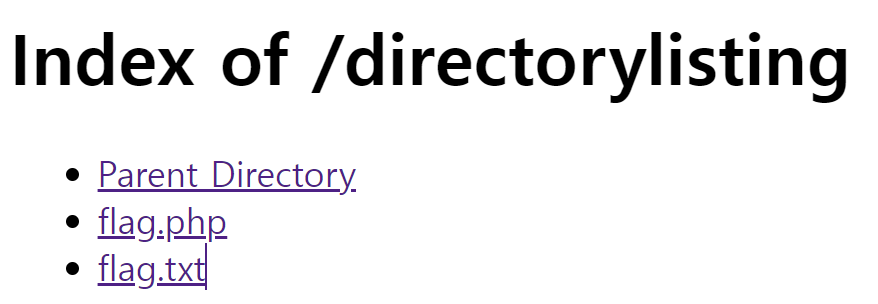

## 🌈 Chapter 1: 웹 해킹

**DDos (Distributed Denial of Service)** : 분산 서비스 공격, 여러대의 컴퓨터를 악성코드에 감염시켜 좀비 PC로 만든 뒤, C&C(명령제어) 서버의 명령을 받아 일제히 특정 서버에 대량 패킷을 전송하는 공격기법

### 📌 환경 구축
[참고](https://soda-dev.tistory.com/52)
1. 아파치 설치
2. PHP 설치

    경로 : `C:\Apache Group\php8\`
3. MySQL 설치

    **<mysql 로그인 방법>**

    cmd 관리자 권한으로 실행 -> `mysql -u root -p` -> 비밀번호 입력

    **<데이터 베이스 생성하기>** 
        
    mysql 로그인 -> cmd에 `create database test;`
4. 툴 설치
    
    웹 프록시 Web Proxy 툴 : 일반적인 외부 서버와 접속하는 프록시가 아니라, 해당 PC의 내부에서 가상 포트를 열고 해당 프로그램이 서버와 웹 브라우저의 HTTP 패킷을 중간에서 전달해주는 역할을 함.
    
    -> Request 혹은 Response 해킷을 가로채거나 수정할 수 있고 드롭도 가능
    
    [**파로스(Paros)**](https://sourceforge.net/projects/paros/)
    
    32bit java jdk를 깔아주고 환경변수에 그 exe 위치를 넣어준후 paros의 바로가기 경로를 그 exe위치로 넣어주면 돌아간다.

    구글 -> 설정 -> 프록시설정 -> localhost, 8080설정후 아무 홈페이지나 들어가면 paros 사이트부분에 이것저것 뜨는것을 볼 수 있다. -> 사용후에 꺼주기.

    Request 값을 변경하거나 어떤 값이 오가는지 확인하고 가로챌 때 파로스가 유용하다.
    
    - 아래 접속 로그를 통해 Request, Response의 값을 보거나 Resend를 할 수 있고, 위 Trap 탭을 통해 Request 혹은 Response 값을 변경 할 수 있다.

### 🔑  구글 해킹 (Google Dork)
구글 검색을 활용한 해킹방법

가능한 한 많은 정보를 수집하는것 == 공격자의 입장에서 공격할 포인트가 많아진다는 것

정보수집 절차에서 구글 해킹은 타겟 사이트에 대한 관리자 페이지 등 많은 정보를 수집하는데 도움을 주소, 심지어 검색많으로 기밀문서나 개인정보가 노출되는 경우도 종종 발생함.

구글은 방대한 사이트 자료를 갖고있고, 여러 검색 고급 연산자를 지원함 -> 많은 정보 획득가능, 취약한 다수의 홈페이지를 단 한번의 검색결과로 가져오기도함.

<구글 검색엔진이 지원하는 검색 부울 연산자>
|연산자|사용 예|설명|
|------|---|---|
|AND|"가"&"나", "가" "나" "가"AND"나"|"가"와"나"의 문자열을 모두 포함하는 문서 검색|
|OR|"가"\|"나", "가"OR"나"|"가"혹은"나" 문자열을 포함하는 문서 검색|
|NOT|"가나다"-"한글", "가나다"NOT"한글"|"가나다" 문자열을 포함하고 "한글" 문자열은 제외한 문서 검색|

<구글 검색엔진이 지원하는 검색 연산자>
|연산자|사용 예|설명|
|------|---|---|
|""|"security conference"|인용부호를 사용해 정확한 단어 혹은 문구를 검색|
|~|~hacking|동의어 또는 관련 검색어와 함께 검색|
|*|* 모아 * 이다|알 수 없는 단어가 위치한 부분에 "*" 연산자를 사용해 검색|
|..|월드컵 1950..2000|숫자사이에 ".."를 넣어 가격, 수치와 같이 범위 문서를 검색|

<구글 검색 고급 연산자>
|연산자|사용 예|설명|
|-----|---|---|
|inurl:|inurl:abc|주소에 "abc"가 들어간 문서 검색|
|intitle:|intitle:해킹|Title에 "해킹"이 들어간 문서 검색|
|intext:|intext:로그인|본문에 "로그인"이 들어간 문서 검색|
|site:|site:http://abc|http://abc 문서에서의 검색|
|link:|link:http://abc|http://abc의 링크가 걸린 문서 검색|
|inanchor|inanchor:http://abc|http://abc가 텍스트로 표현된 문서 검색|
|filetype:|filetype:jpg|jpg 확장자 검색|
|cache:|cache:http://abc|구글에 저장된 http://abc 페이지 보기|
|numrange:|numrange:1000-2000|1000-2000 숫자 범위의 결과 검색|

#### 검색을 이용한 공격
1. **백업 파일의 노출**
    
    대부분의 편집용 프로그램에서 기본적으로 제공하는 백업 기능은 특정 파일이 편집중이거나 삭제되었을 때 다음과 같은 백업 파일을 저장한다.
        
        Vi editor : .{파일명}.{확장자}.swp
        EditPlus, UltraEdit : {파일명}.{확장자}.bak
        기타 : {파일명}.{확장자}.back, {파일명}.{확장자}.backup 등
    홈 폴더에 관리자의 실수로 다음과 같은 백업 파일을 남겨놓는 경우가 종종있다.

        html.tar.gz
        public_html.tar.gz
        www.tar.gz
        sql.sql
        db.sql
        backup.sql
        ...
2. **관리자 페이지 권한의 실수, 노출**

    아직도 많은 홈페이지들이 /admin/ 이나 /manager/와 같은 관리자 페이지를 사용하고 있다.
    
     ex) `http://www.xxx.com/admin/`,`http://www.xxx.com/manager/`,`http://www.xxx.com/master/`,`http://www.admin.com/`,...

    -> `site:xxx.com`,`inurl:admin` 같은 쿼리로 관리자 페이지를 찾아낼 수 있고, admin 폴더 내부 파일을 검색 할 수도 있다. 그리고 관리자 페이지의 경우 모든 파일이 관리자 권한을 체크하는 기능을 포함해야하지만, 관리자 메인 페이지를 제외하고 체크하지 않는 경우가 빈번해서 문제가 되고있다.
3. **기밀 업로드 파일의 관리실수**

    파일 업로드 기능이 있는 게시판 경우, 대다수가 다음과 같은 폴더에 업로드한 파일을 저장한다. 만약 비밀글이 있고 파일이 첨부 되어있다면, `inurl:/board/data/`,`site:xxx.com`과 같은 쿼리를 통해 비밀 글의 첨부파일을 받아볼 수도 있다.
    
        /pds/
        /upload/
        /up/
        /data/
        /file/
        /files/
        ...
4. **디렉터링 리스팅**

    웹 서버의 특정경로에 있는 파일들을 웹 서비스를 통해 디렉토리 형식으로 볼 수 있는것을 말함.

    디렉터링 리스팅 취약점 : 의도치 않게 서버에 있는 자료가 노출될 수 있다.
    
    웹 서버의 폴더 요청 시 index 파일이 존재하지 않을 경우 그림과 같이파일 목록을 출력해주는 아파치 옵션. 환경에 따라 기본옵션이 켜져있는 경우가 많기 때문에 백업 파일이나 중요 정보 파일이 노출되는 사례가많다. 

간단하게 디렉터링 리스팅 실습을 해보자.
`Apache24/htdocs/`에 `directorylisting`이라는 간단한 directory를 만들고 어떠한 index.html, main.asp(기본페이지)도 넣지 않고 추가적인 파일들을 넣어줬다.
http://localhost/directorylisting/
로 URL 입력을 디렉토리까지만하고 요청을 해보았다.

파일들이 노출됨을 알 수 있다.

디렉터리 리스팅 페이지의 타이틀 문자열인 "Index of"와 본문의 "Parent Directory" 등 문자열들을 이용해 구글에서 디렉터리 리스팅 취약점이 있는 사이트만 검색할 수 있다. 하지만 디렉터리 리스팅은 아파치 옵션으로서 고의적으로 리스팅을 허용하는 페이지도 있다.

4. **웹 쉘 노출**

    이미 다른해커의 공격받아 생성된 웹 쉘을 찾아낸다면, 해당 서버는 다양한 공격을 거치지 않고 구글 해킹만으로 점령할 수 있게된다. 해당 웹 쉘의 특정문자열을 이용해 검색 쿼리를 제작하면, 많은 서버를 획득 할 수 있다.

#### 구글 해킹 예제
    