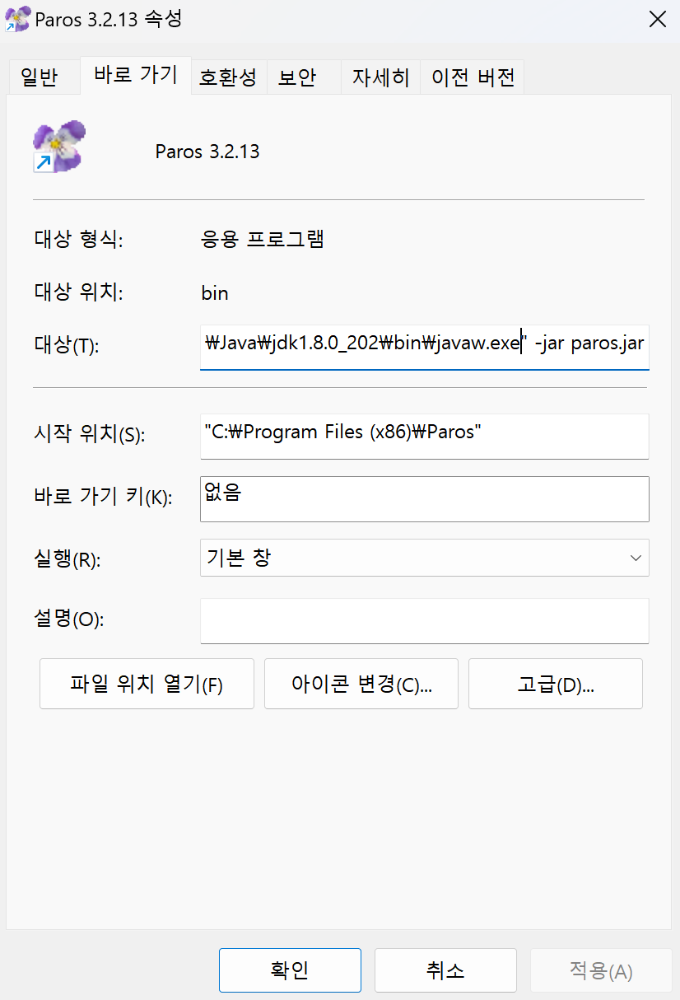
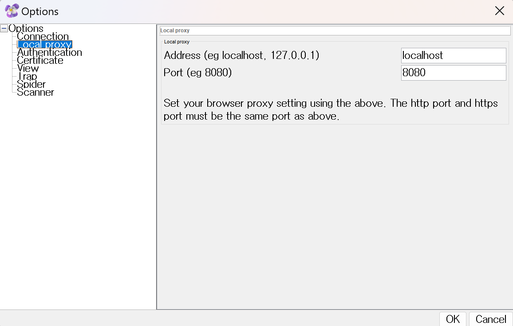

# 🛠️ How to Install and Use Paros

## 📥 Install

### 1. Install Java JDK 32-bit ☕

Paros requires a 32-bit JDK or JRE to operate. If you use a different version of Java, you might encounter an infinite loading screen.

- **Install link**: [Java SE 8 Archive Downloads](https://www.oracle.com/java/technologies/javase/javase8-archive-downloads.html)

Check the path to `javaw.exe`.

Example: `"C:\Program Files (x86)\Java\jdk1.8.0_202\bin\javaw.exe"`

### 2. Install Paros 🐞

- **Install link**: [Paros on SourceForge](https://sourceforge.net/projects/paros/)

An optional shortcut for Paros can be created on the desktop.

### 3. Set Environment Variables ⚙️

1. Right-click on "This PC" or "My Computer" and select "Properties".
2. Click on "Advanced system settings".
3. Go to the "Advanced" tab and click on "Environment Variables".
4. Under "System variables", find and select the "Path" variable, then click "Edit".
5. Add the path to `javaw.exe`, for example: `C:\Program Files (x86)\Java\jdk1.8.0_202\bin\javaw.exe`.

### 4. Modify Shortcut Target 🎯

1. Right-click on the Paros shortcut on the desktop.
2. Select "Properties".
3. In the "Shortcut" tab, find the "Target" field.
4. Change the target to `"C:\Program Files (x86)\Java\jdk1.8.0_202\bin\javaw.exe" -jar paros.jar` (adjust the path to match the location of your `javaw.exe` file).

## Configuring Proxy for Paros

### 1. Setting Up Proxy on Your System

Navigate to `Settings -> Network & Internet -> Proxy -> Manual proxy setup -> Use a proxy server`.

Set the following:
- **Address or IP**: `localhost` or `127.0.0.1`
- **Port**: `8080`

Save the settings. Remember to disable this proxy configuration once you finish using Paros to restore normal internet functionality.

### 2. Configuring Paros Proxy

After launching Paros:

- Go to `Tool -> Options -> Local proxy`.
- Set the proxy `Address` and `Port` to match your earlier settings (`localhost` and `8080`).

## Using Paros

1. **Accessing Websites**:
   - When you access a website, you may encounter a warning about the connection not being secure.
   - Click on "Advanced" and proceed to the site (`http://example.com (unsafe)`).

2. **Using Trap Response**:
   - Navigate to `Trap -> Trap Response` to modify responses before they reach the client. Changes made here are visible only to you.

3. **Capturing Cookies**:
   - Use `Trap -> Trap Request` to intercept requests and potentially capture cookie values or modify requests in transit.

By following these steps, you can effectively use Paros for testing and manipulating HTTP/HTTPS traffic, including modifying responses and capturing sensitive information like cookies for security testing purposes.
