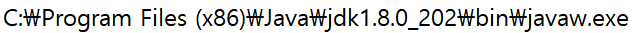
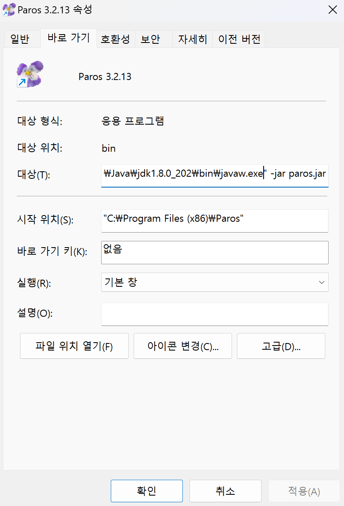
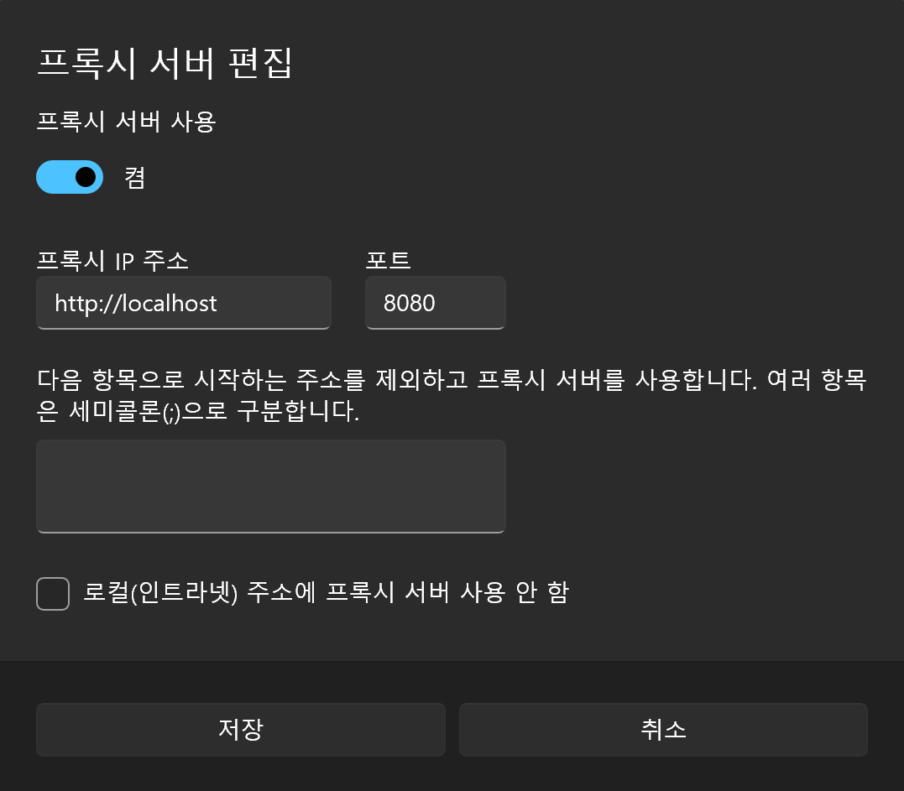
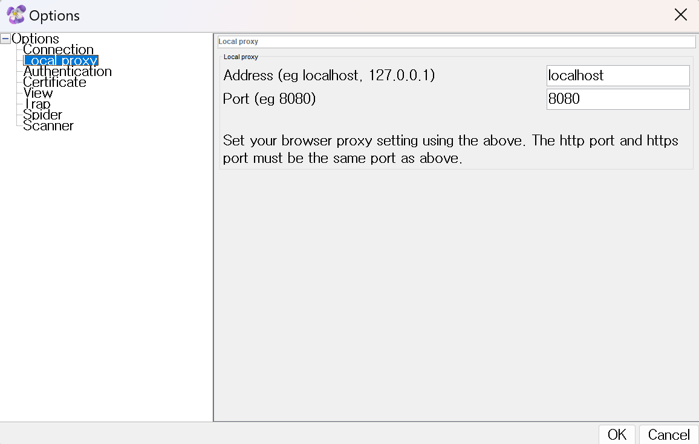

# 🛠️ 파로스 설치 및 사용법

## 📥 설치

### 1. 32-bit Java JDK 설치 ☕

파로스는 32-bit JDK 또는 JRE가 필요합니다. 다른 버전의 Java를 사용하면 무한로딩 화면이 발생할 수 있습니다.

- **설치 링크**: [Java SE 8 아카이브 다운로드](https://www.oracle.com/java/technologies/javase/javase8-archive-downloads.html)

`javaw.exe`의 경로를 확인합니다.

예시: `"C:\Program Files (x86)\Java\jdk1.8.0_202\bin\javaw.exe"`

### 2. 파로스 설치 🐞

- **설치 링크**: [파로스 다운로드 페이지](https://sourceforge.net/projects/paros/)

파로스의 바로 가기 아이콘이 필요하다면 바탕화면에 생성할 수 있습니다.

### 3. 환경 변수 설정 ⚙️

1. "내 PC" 혹은 "내 컴퓨터"를 우클릭하고 "속성"을 선택합니다.
2. "고급 시스템 설정"을 클릭합니다.
3. "고급" 탭으로 이동하고 "환경 변수"를 클릭합니다.
4. "시스템 변수"에서 "Path" 변수를 찾고 선택한 후 "편집"을 클릭합니다.
5. `javaw.exe`의 경로를 추가합니다. 예: `C:\Program Files (x86)\Java\jdk1.8.0_202\bin\javaw.exe`

### 4. 바로 가기 대상 변경 🎯

1. 바탕화면의 파로스 바로 가기 아이콘을 우클릭하고 "속성"을 선택합니다.
2. "단축" 탭에서 "대상" 필드를 찾습니다.
3. 대상을 다음과 같이 변경합니다: `"C:\Program Files (x86)\Java\jdk1.8.0_202\bin\javaw.exe" -jar paros.jar` (`javaw.exe` 파일 경로에 맞게 수정)

## 파로스 프록시 설정

### 1. 시스템 프록시 설정

시스템 설정으로 이동하여 프록시를 설정합니다:

`설정 -> 네트워크 및 인터넷 -> 프록시 -> 수동 프록시 설정 -> 프록시 서버 사용`

다음과 같이 설정합니다:
- **주소 또는 IP**: `localhost` 또는 `127.0.0.1`
- **포트**: `8080`

설정을 저장합니다. 파로스 사용이 끝나면 정상적인 인터넷 기능을 복원하기 위해 이 설정을 비활성화 해야 합니다.

### 2. 파로스 프록시 설정

파로스를 실행한 후:

- `도구 -> 옵션 -> 로컬 프록시`로 이동합니다.
- 프록시 `주소`와 `포트`를 이전 설정과 동일하게 설정합니다 (`localhost`와 `8080`).

## 파로스 사용하기

1. **웹사이트 접근**:
   - 웹사이트에 접근할 때 연결이 안전하지 않다는 경고가 표시될 수 있습니다.
   - "고급"을 클릭하고 사이트에 진입합니다 (`http://example.com (unsafe)`).

2. **Trap Response 사용**:
   - `Trap -> Trap Response`로 이동하여 클라이언트에 도달하기 전에 응답을 수정할 수 있습니다. 여기서 한 번에 변경한 내용은 본인만 볼 수 있습니다.

3. **쿠키 캡처**:
   - `Trap -> Trap Request`를 사용하여 요청을 가로채고 쿠키 값을 탈취하거나 요청을 수정할 수 있습니다.

위 단계를 따라서 파로스를 사용하여 HTTP/HTTPS 트래픽을 효과적으로 테스트하고 조작할 수 있습니다. 이 과정에서 응답을 수정하고 쿠키와 같은 민감한 정보를 포착할 수 있어 보안 테스트에 유용합니다.
