## 🌈 Chapter 3: 리버스 엔지니어링

**Reverse Engineering** : 만들어진 제품, 도구를 분해해 분석하거나 재조합하는 것

#### 리버싱으로 뭘 할 수 있냐..? 🔍

- 컴퓨터 원리와 구조이해
- 프로그램 유지보수
- 개발에 활용 : 한국에서는 프로그램 리버싱을 금지함
- 보안점검 및 취약점 찾기
- 악성코드 분석

### 🏗️ 환경구축
---
1. Visual Studio 설치
2. [올리디버거 (OllyDbg) 설치](http://www.ollydbg.de)
    
    압축해제 후 , Plugin, UDD (breakpoint, 주석 등 작업내용 저장) 2개의 directory를 만들어준다.

    OllyDbg -> Option -> Appearance -> Directories -> UDD, Plugin 경로 변경해주기. 

    ollydbg.ini 수정해주기
    ```md
    [Settings]
    Check DLL versions=0
    Show jump direction=1
    Show jump path=1
    Show jumpfrom path=1
    Show path if jump is not taken=1
    ```
    `잘 안되면 관리자권한으로 설정해주면 다 해결된다.`
3. 계산기

    단축키: 2진수F5 8진수F6 10진수F7 16진수F8

### 🧠 기초지식 IA-32(x86-32)
---
#### 중앙연산처리장치 CPU 💻

*외부로부터 명령어를 입력받아 해석하고 연산해서 실행함*

CPU 내부에서 각종 정보를 저장하기 위해 임시 기억 장치인 레지스터를 사용하고, 레지스터만으로는 저장할 수 있는 정보 양이 매우 적으므로 주기억장치인 메모리를 사용한다.

**주기억장치 메모리 == RAM (random access memory)** : 휘발성 메모리 volatile memory

**하드디스크** : Non-volatile memory <- 컴퓨터가 사용

(빠르고 용량 작음) `CPU - 레지스터 - 메모리 - 하드디스크` (느리고 용량 큼)

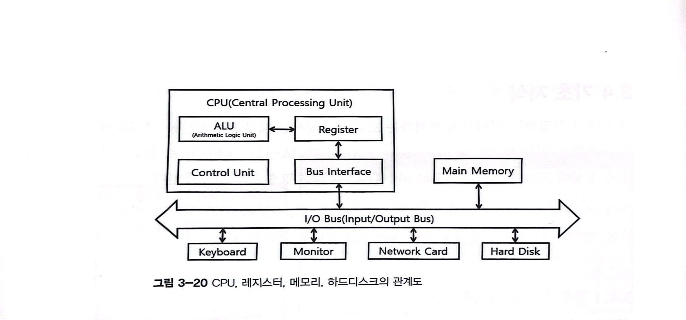

#### IA-32 레지스터 💻


<레지스터 종류>
- 8개의 32bit 범용레지스터 (general register)
- 6개의 16bit 세그먼트 레지스터(segment register)
- 32bit EFLAGS 레지스터 (Program status and control register)
- 32bit ELP 레지스터 (Extended Instruction Pointer register)

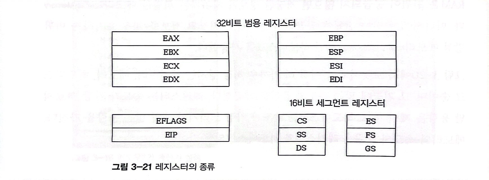

- **범용 레지스터**

    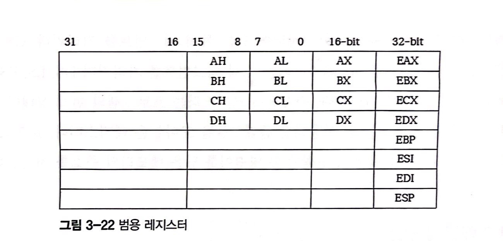

    16비트나 8비트 등으로 나눠 쓸수도 있다. 64bit -> rax..

        EAX : return 값 , 산술연산
        EBX : 특정 주소 지정
        ECX : 반복적인 명령어 수행시 횟수 저장
        EDX : 큰수 곱셈, 나눗셈 등의 연산시 EAX 레지스터와 함께 사용
        ESI : 문자열 복사, 비교시 소스 문자열 주소 저장에 사용
        ESP : 스택위치 저장
        EBP : 함수인자, 스택변수에 접근하기 위해 사용

- **세그먼트 레지스터**

    메모리에 저장되어있는 특정 세그먼트 가리킴

        CS : 코드 세그먼트 가리킴
        SS : 스택 세그먼트 가리킴
        DS, ES, FS, GS : 데이터 세그먼트 가리킴

- **ELFAG 레지스터**

    프로그램의 현재상태나 분기문의 조건 등을 검사하는데 사용되는 플래그들을 모아놓은 레지스터

- **EIP 레지스터**

    CPU 가 다음에 수행해야 할 명령어를 담은 메모리의 주소 저장

#### 메모리 구조 💻

32bit 만큼 메모리에 접근가능. 프로그램이 실행되면 segment 단위로 묶어 메모리에 저장. 각각의 세그먼트는 코드 세그먼트, 스택 세그먼트, 데이터 세그먼트다.

- **코드세그먼트**: 컴퓨터가 수행할 수 있는 명령어들이 저장되어있는 메모리. 

- **스택세그먼트**: 현재 수행중인 프로그램의 지역변수, 함수호출 인자를 저장하는 메모리. PUSH POP으로 데이터를 읽고 씀. ESP가 현재위치를 가리킴. LIFO 구조로 거꾸로 쌓임.

    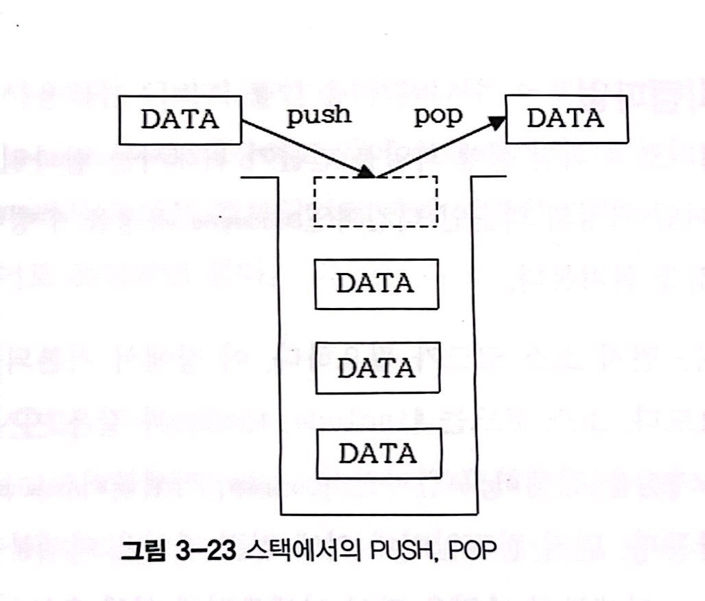

- **데이터세그먼트**: 전역변수, 힙 heap 저장하는 메모리.

#### 어셈블리 vs. C언어 💻

**Assembly Language** : *기계어 코드를 사람이 인식할 수 있도록 1:1 대응시키는 컴퓨터의 low level 언어* . 프로세서에 따라 기계어가 달라지며, 이에 따라 어셈블리어도 달라짐.

**C Language** : *프로세서가 다르더라도 같은 소스코드를 해당 프로세서에서 컴파일해 사용할 수 있는 high level 언어*

#### 컴파일, 디컴파일 💻

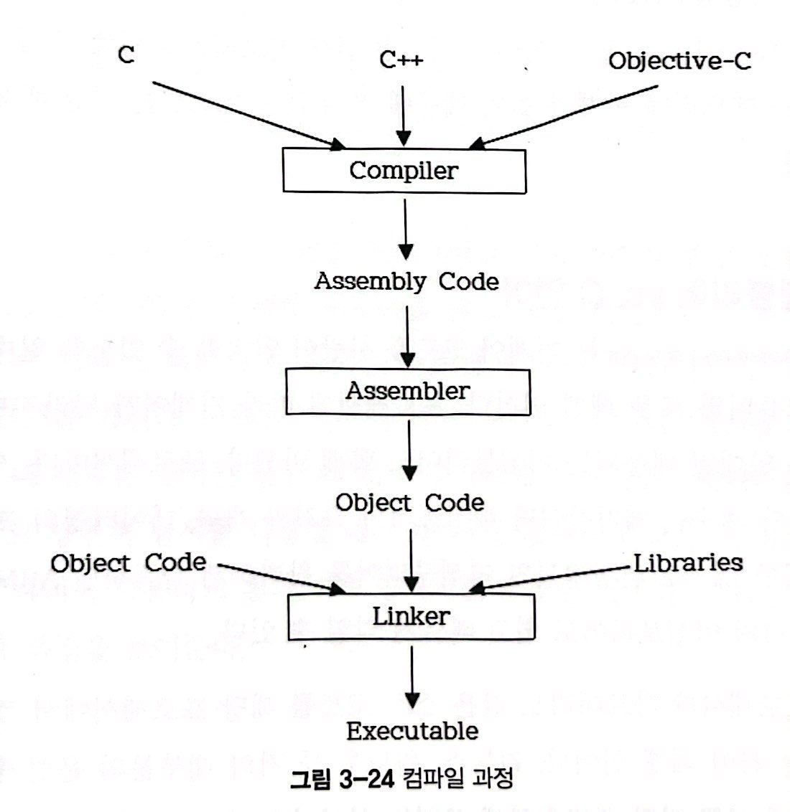

1. 전처리기 Processor : #include #define과 같은 지시자를 처리
2. 컴파일러 Compiler : 입력파일->어셈블리파일 (컴파일)
3. 어셈블러 Assembler : 어셈블리파일->오브젝트파일
4. 링커 Linker : 각종 라이브러리 함수와 연결되어 최종 실행 파일 완성

리버싱 : Decompile 과정 수행해야함. Decompiler로 어셈블리어 -> C언어로 복원

#### 바이트 오더 💻

- Big Endian
- Little Endian (IA-32)

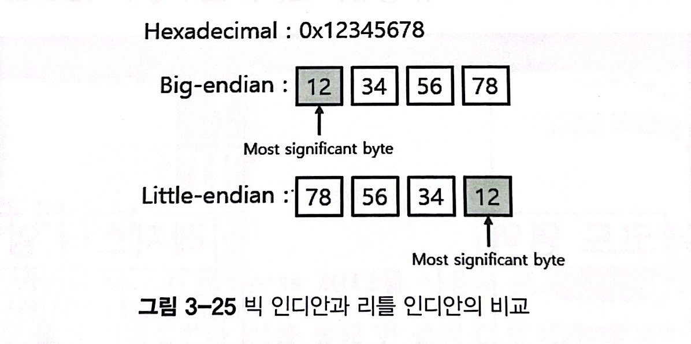


#### 디버깅 💻

**Debugging** : *컴퓨터 프로그램의 버그를 찾아 제거하는 일련의과정*
break point 걸고 프로그램 실행을 중단하고 레지스터, 메모리에 저장된 값을 보며 재실행하거나, 코드를 단계적으로 실행


~~굳이 이거 써야하나 싶은데 일단 따라해봄 나중에 IDA쓰던가 해야지..~~
- Ctrl + F12 : restart
- F2 : breakpoint
- F7 : si
- F8 : ni
- F9 : 프로그램 실행
- Ctrl + G : 특정 주소위치로 이동
- ; : 주석

### 한 줄 리버싱 ↩️ `오른쪽 -> 왼쪽`
#### 지역변수

3_1 예제파일은 지역변수 lv를 선언하고 출력하는 소스코드다. 

컴파일하여 실행파일을 만들고 ollygdb에 올려보자. (ollygdb는 32bit 만 가능)

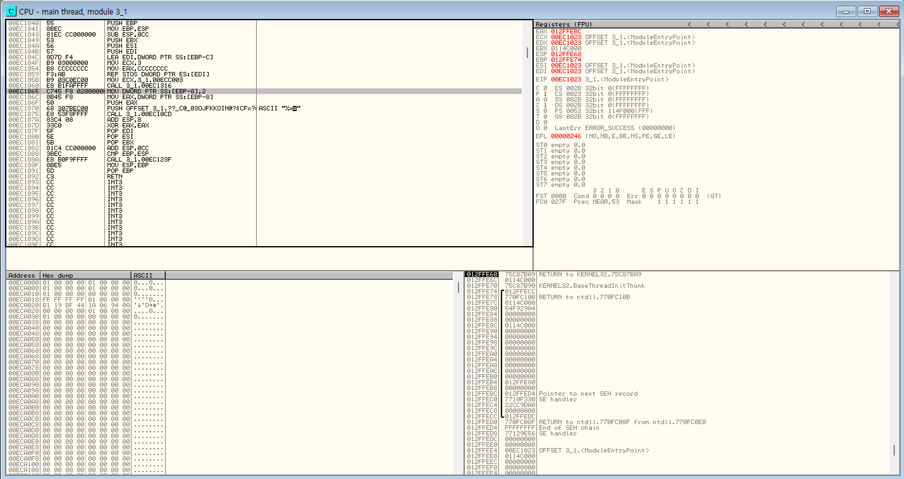

`Ctrl+G` 를 눌러 main을 검색해준다.

어셈블리어코드를 보면, [EBP-8]위치에 2를 넣어준다. 지역변수로 선언된 lv는 어셈블리어로 보면 스택에 저장된다. 

EBP 레지스터는 스택 변수에 접근하기위해 스택의 특정 위치를 가리킨다. lv는 EBP 레지스터에서 8만큼 떨어져있는 곳에 할당된 것을 알 수 있다.

#### 전역변수

3_3 예제파일은 전역변수 gv를 선언하고 출력하는 소스코드다. 

컴파일하여 실행파일을 만들고 ollygdb에 올려보자.

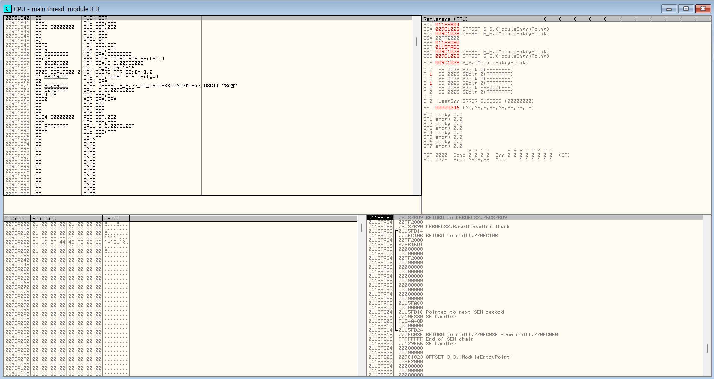

어셈블리어를 보면 전역변수는 data segment 위치에 저장한다. 

MOV DWORD PTR DS:[gv],2 를 더블클릭하면
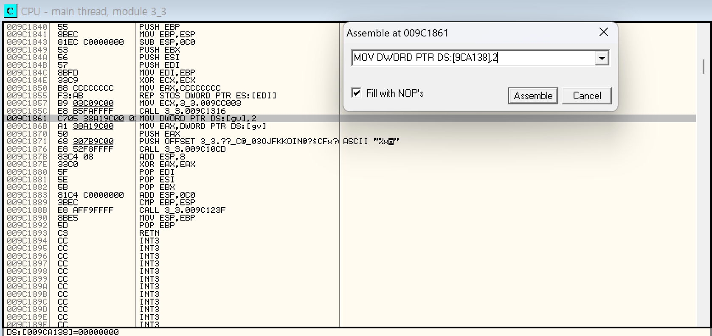
전역변수 gv의 정확한 메모리 위치가 표시된다. 

전역변수로 선언할 경우, EBP 레지스터가 아닌 특정 메모리 주소에 저장된다. 따라서 모든 함수에서 사용가능하다.

#### 구조체

3_5 예제파일은 지역변수로 구조체인 ST를 선언하고 출력하는 소스코드다. 

컴파일하여 실행파일을 만들고 ollygdb에 올려보자.

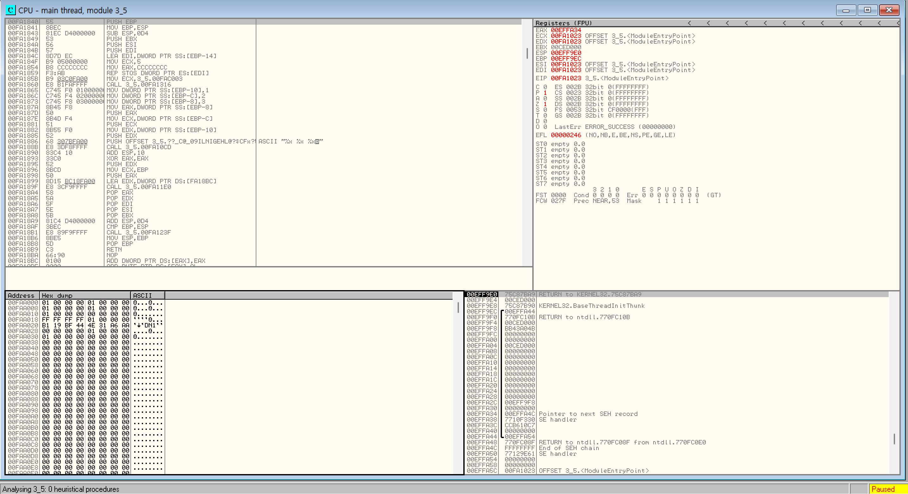

int가 4byte니까 구조체의 총크기는 12byte가 된다. 

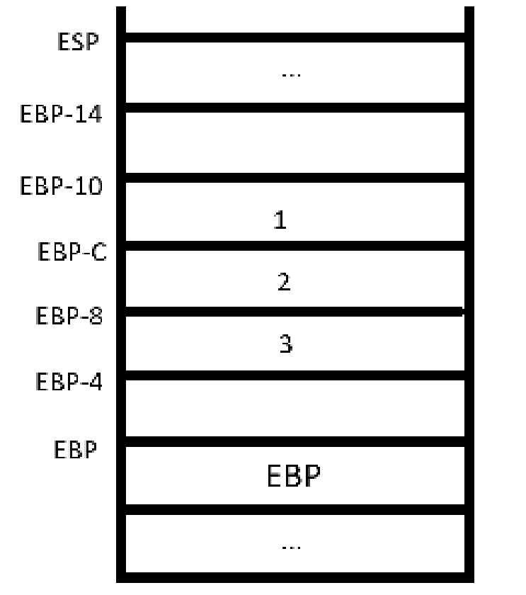

#### if 리버싱

3_7 예제파일은 lv에 2를 할당하고 0보다 큰지 비교하는 무조건 참이되는 소스코드다. 

컴파일하여 실행파일을 만들고 ollygdb에 올려보자.

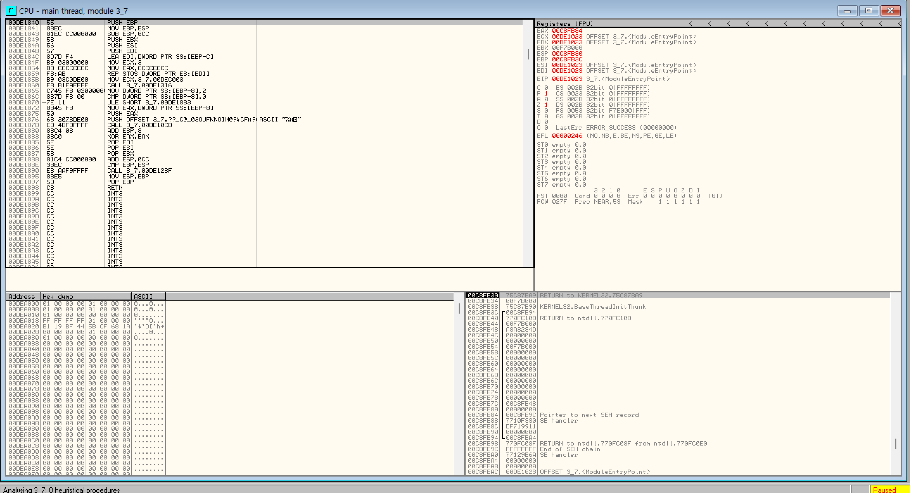

`lv([EBP-8])`에 2를 할당하고, `CMP 명령어`로 상수 0과 비교를 한 후 결과값을 `EFLAGS 레지스터`의 사인플래그에 저장을 한다. `JLE 명령어`로 CMP가 설정한 `EFLAGS 레지스터`의 값을 보고 점프여부를 결정한 후 점프한다. ! 2<=0 이므로 점프하지않는다.

#### switch 리버싱

3_9 예제파일은 지역변수인 lv에 의해 6개의 분기가 존재하는 소스다.

컴파일하여 실행파일을 만들고 ollygdb에 올려보자.

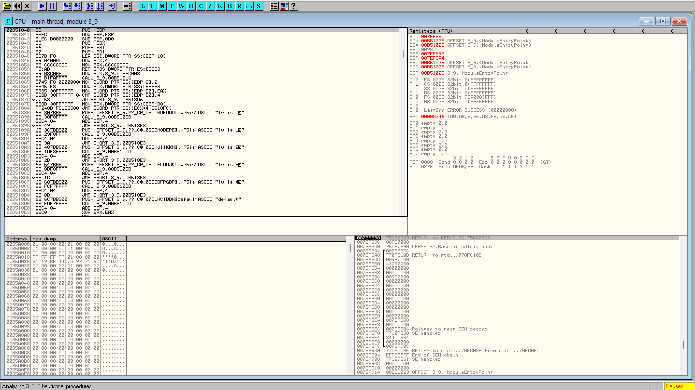

먼저 default jump 문부터 나온다. 지역변수인 `[EBP-8]` 에 2를 먼저 할당하고, 4와 비교해 `JA 명령어`를 수행한다. 

4보다 작을 경우, if else 문처럼 하나씩 비교하는게 아니라 `JMP DWORD PTR DS:[ECX*4+B518FC]` 명령어에 의해 계산된 주소로 한 번에 점프하게된다. 

이와같이 *분기가 많을 경우 switch case문을 쓰면 모든 분기문을 거치지 않기때문에 if else문보다 빠르다.* 분기 수가 적으면 if else문과 다를게 없다.

#### for 리버싱

3_13 예제파일은 반복문을 실행하는 소스다.

컴파일하여 실행파일을 만들고 ollygdb에 올려보자.

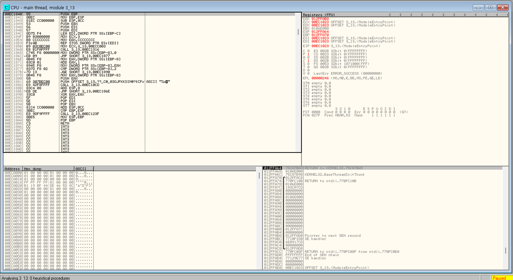

지역변수인 lv([EBP-8])에 먼저 0을 할당하고 CMP명령어로 먼저 2와 비교를해 FLAG 설정을 해준다. 

해당 FLAG를 보고 JGE 명령어에 의해 할당된 변수값이 2보다 크거나 같으면 점프하여 반복문을 빠져나가고 아니면 다시 반복문을 돈다. 그런 후 [EBP-8] ++ 를 해준다.

    1. for 문 초기화
    2. 조건문 검사 (! 기준으로)
    3. for 문안의 코드실행
    4. 연산 (++)
    5. 조건문 검사

#### while 리버싱

3_15 예제파일은 무한히 반복하며 지역변수 lv가 2일때 빠져나오는 소스다.

컴파일하여 실행파일을 만들고 ollygdb에 올려보자.

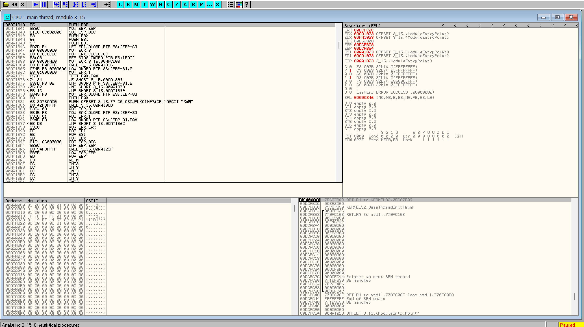

지역변수 `lv([EBP-8])`에 0을 먼저 할당한다. `CMP 명령어`로 2와 먼저 비교해, `JNZ 명령어`에 의해 `[EBP-8]`에 할당된 변수가 2가 아니면 점프를 실행한다. 

2일경우 다음주소의 `JMP 명령어`를 실행해 반복문을 나간다.(break 해당부분) 2가 아닐경우 다음코드를 실행하고 제일 아래주소의 `JMP 명령어`에 의해 반복하게 된다.

### 함수 리버싱 ↩️
~~살려주세요 너무힘들어요 아는내용인데 그냥 보지말까..~~
#### 콜링 컨벤션 Calling Convention

*함수가 어떻게 인자를 전달받고 자신을 호출한 함수에게 리턴값을 어떻게 다시 돌려주는지에 대한 약속된 함수 호출 규약*

<호출 규약>
|구분|__cdecl|__stdcall|__fastcall|
|----|-------|---------|----------|
|인자 전달 방법|스택|스택|레지스터, 스택|
|스택 해제 방법|호출한 함수|호출된 함수|호출된 함수|

- **__cdecl**
- **__stdcall**
- **__fastcall**

#### 함수 호출 리턴값 확인
#### 함수 프롤로그, 에필로그
#### 지역변수, 전역변수, 포인터


### 패치 🔧
#### 원하는 코드 위치 찾기
#### 메모리 패치
#### 코드 패치
#### 파일 저장


~~느낀점 : 그냥 IDA 쓰자.~~
### 실전 🎯
#### 비밀번호
#### 시리얼
#### 네트워크 통신

