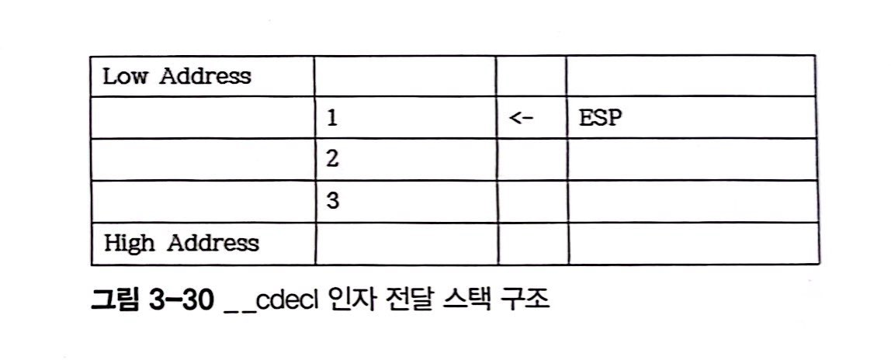
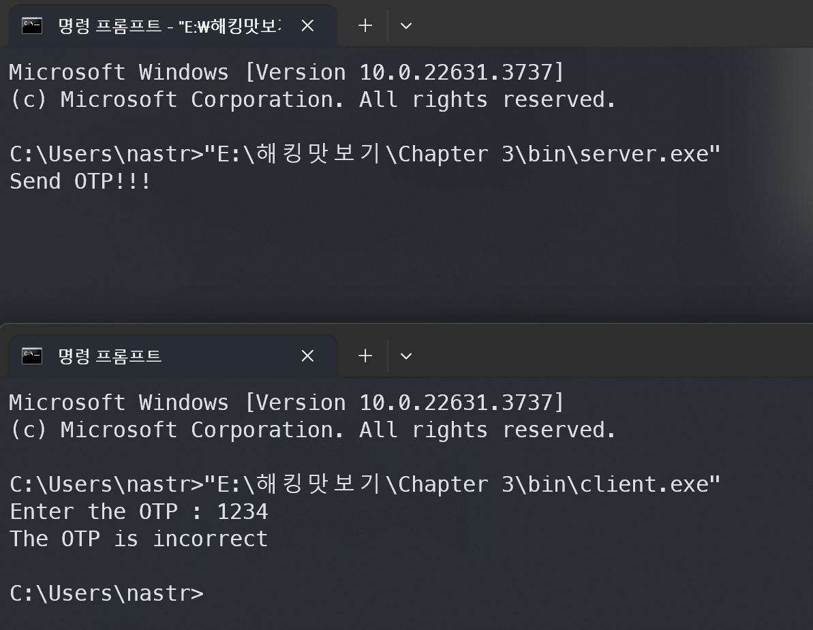
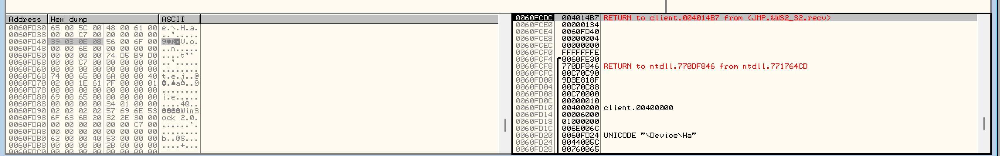
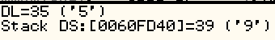

## 🌈 Chapter 3: 리버스 엔지니어링

**Reverse Engineering** : 만들어진 제품, 도구를 분해해 분석하거나 재조합하는 것

#### 리버싱으로 뭘 할 수 있냐..? 🔍

- 컴퓨터 원리와 구조이해
- 프로그램 유지보수
- 개발에 활용 : 한국에서는 프로그램 리버싱을 금지함
- 보안점검 및 취약점 찾기
- 악성코드 분석

### 🏗️ 환경구축
---
1. Visual Studio 설치
2. [올리디버거 (OllyDbg) 설치](http://www.ollydbg.de)
    
    압축해제 후 , Plugin, UDD (breakpoint, 주석 등 작업내용 저장) 2개의 directory를 만들어준다.

    OllyDbg -> Option -> Appearance -> Directories -> UDD, Plugin 경로 변경해주기. 

    ollydbg.ini 수정해주기
    ```md
    [Settings]
    Check DLL versions=0
    Show jump direction=1
    Show jump path=1
    Show jumpfrom path=1
    Show path if jump is not taken=1
    ```
    `잘 안되면 관리자권한으로 설정해주면 다 해결된다.`
3. 계산기

    단축키: 2진수F5 8진수F6 10진수F7 16진수F8

### 🧠 기초지식 IA-32(x86-32)
---
#### 중앙연산처리장치 CPU 💻

*외부로부터 명령어를 입력받아 해석하고 연산해서 실행함*

CPU 내부에서 각종 정보를 저장하기 위해 임시 기억 장치인 레지스터를 사용하고, 레지스터만으로는 저장할 수 있는 정보 양이 매우 적으므로 주기억장치인 메모리를 사용한다.

**주기억장치 메모리 == RAM (random access memory)** : 휘발성 메모리 volatile memory

**하드디스크** : Non-volatile memory <- 컴퓨터가 사용

(빠르고 용량 작음) `CPU - 레지스터 - 메모리 - 하드디스크` (느리고 용량 큼)


#### IA-32 레지스터 💻


<레지스터 종류>
- 8개의 32bit 범용레지스터 (general register)
- 6개의 16bit 세그먼트 레지스터(segment register)
- 32bit EFLAGS 레지스터 (Program status and control register)
- 32bit ELP 레지스터 (Extended Instruction Pointer register)


- **범용 레지스터**

    

    16비트나 8비트 등으로 나눠 쓸수도 있다. 64bit -> rax..

        EAX : return 값 , 산술연산
        EBX : 특정 주소 지정
        ECX : 반복적인 명령어 수행시 횟수 저장
        EDX : 큰수 곱셈, 나눗셈 등의 연산시 EAX 레지스터와 함께 사용
        ESI : 문자열 복사, 비교시 소스 문자열 주소 저장에 사용
        ESP : 스택위치 저장
        EBP : 함수인자, 스택변수에 접근하기 위해 사용

- **세그먼트 레지스터**

    메모리에 저장되어있는 특정 세그먼트 가리킴

        CS : 코드 세그먼트 가리킴
        SS : 스택 세그먼트 가리킴
        DS, ES, FS, GS : 데이터 세그먼트 가리킴

- **ELFAG 레지스터**

    프로그램의 현재상태나 분기문의 조건 등을 검사하는데 사용되는 플래그들을 모아놓은 레지스터

- **EIP 레지스터**

    CPU 가 다음에 수행해야 할 명령어를 담은 메모리의 주소 저장

#### 메모리 구조 💻

32bit 만큼 메모리에 접근가능. 프로그램이 실행되면 segment 단위로 묶어 메모리에 저장. 각각의 세그먼트는 코드 세그먼트, 스택 세그먼트, 데이터 세그먼트다.

- **코드세그먼트**: 컴퓨터가 수행할 수 있는 명령어들이 저장되어있는 메모리. 

- **스택세그먼트**: 현재 수행중인 프로그램의 지역변수, 함수호출 인자를 저장하는 메모리. PUSH POP으로 데이터를 읽고 씀. ESP가 현재위치를 가리킴. LIFO 구조로 거꾸로 쌓임.

    

- **데이터세그먼트**: 전역변수, 힙 heap 저장하는 메모리.

#### 어셈블리 vs. C언어 💻

**Assembly Language** : *기계어 코드를 사람이 인식할 수 있도록 1:1 대응시키는 컴퓨터의 low level 언어* . 프로세서에 따라 기계어가 달라지며, 이에 따라 어셈블리어도 달라짐.

**C Language** : *프로세서가 다르더라도 같은 소스코드를 해당 프로세서에서 컴파일해 사용할 수 있는 high level 언어*

#### 컴파일, 디컴파일 💻


1. 전처리기 Processor : #include #define과 같은 지시자를 처리
2. 컴파일러 Compiler : 입력파일->어셈블리파일 (컴파일)
3. 어셈블러 Assembler : 어셈블리파일->오브젝트파일
4. 링커 Linker : 각종 라이브러리 함수와 연결되어 최종 실행 파일 완성

리버싱 : Decompile 과정 수행해야함. Decompiler로 어셈블리어 -> C언어로 복원

#### 바이트 오더 💻

- Big Endian
- Little Endian (IA-32)


#### 디버깅 💻

**Debugging** : *컴퓨터 프로그램의 버그를 찾아 제거하는 일련의과정*
break point 걸고 프로그램 실행을 중단하고 레지스터, 메모리에 저장된 값을 보며 재실행하거나, 코드를 단계적으로 실행



~~굳이 이거 써야하나 싶은데 일단 따라해봄 나중에 IDA쓰던가 해야지..~~
- Ctrl + F12 : restart
- F2 : breakpoint
- F7 : si
- F8 : ni
- F9 : 프로그램 실행
- Ctrl + G : 특정 주소위치로 이동
- ; : 주석

### ↩️ 한 줄 리버싱 `오른쪽 -> 왼쪽`
---
#### 지역변수 🏠 

3_1 예제파일은 지역변수 lv를 선언하고 출력하는 소스코드다. 

컴파일하여 실행파일을 만들고 ollygdb에 올려보자. (ollygdb는 32bit 만 가능)


`Ctrl+G` 를 눌러 main을 검색해준다.

어셈블리어코드를 보면, [EBP-8]위치에 2를 넣어준다. 지역변수로 선언된 lv는 어셈블리어로 보면 스택에 저장된다. 

EBP 레지스터는 스택 변수에 접근하기위해 스택의 특정 위치를 가리킨다. lv는 EBP 레지스터에서 8만큼 떨어져있는 곳에 할당된 것을 알 수 있다.

#### 전역변수 🌍

3_3 예제파일은 전역변수 gv를 선언하고 출력하는 소스코드다. 

컴파일하여 실행파일을 만들고 ollygdb에 올려보자.


어셈블리어를 보면 전역변수는 data segment 위치에 저장한다. 

MOV DWORD PTR DS:[gv],2 를 더블클릭하면

전역변수 gv의 정확한 메모리 위치가 표시된다. 

전역변수로 선언할 경우, EBP 레지스터가 아닌 특정 메모리 주소에 저장된다. 따라서 모든 함수에서 사용가능하다.

#### 구조체 🧩

3_5 예제파일은 지역변수로 구조체인 ST를 선언하고 출력하는 소스코드다. 

컴파일하여 실행파일을 만들고 ollygdb에 올려보자.


int가 4byte니까 구조체의 총크기는 12byte가 된다. 


#### if 리버싱 🔄

3_7 예제파일은 lv에 2를 할당하고 0보다 큰지 비교하는 무조건 참이되는 소스코드다. 

컴파일하여 실행파일을 만들고 ollygdb에 올려보자.


`lv([EBP-8])`에 2를 할당하고, `CMP 명령어`로 상수 0과 비교를 한 후 결과값을 `EFLAGS 레지스터`의 사인플래그에 저장을 한다. `JLE 명령어`로 CMP가 설정한 `EFLAGS 레지스터`의 값을 보고 점프여부를 결정한 후 점프한다. ! 2<=0 이므로 점프하지않는다.

#### switch 리버싱 🔄

3_9 예제파일은 지역변수인 lv에 의해 6개의 분기가 존재하는 소스다.

컴파일하여 실행파일을 만들고 ollygdb에 올려보자.


먼저 default jump 문부터 나온다. 지역변수인 `[EBP-8]` 에 2를 먼저 할당하고, 4와 비교해 `JA 명령어`를 수행한다. 

4보다 작을 경우, if else 문처럼 하나씩 비교하는게 아니라 `JMP DWORD PTR DS:[ECX*4+B518FC]` 명령어에 의해 계산된 주소로 한 번에 점프하게된다. 

이와같이 *분기가 많을 경우 switch case문을 쓰면 모든 분기문을 거치지 않기때문에 if else문보다 빠르다.* 분기 수가 적으면 if else문과 다를게 없다.

#### for 리버싱 🔄

3_13 예제파일은 반복문을 실행하는 소스다.

컴파일하여 실행파일을 만들고 ollygdb에 올려보자.


지역변수인 lv([EBP-8])에 먼저 0을 할당하고 CMP명령어로 먼저 2와 비교를해 FLAG 설정을 해준다. 

해당 FLAG를 보고 JGE 명령어에 의해 할당된 변수값이 2보다 크거나 같으면 점프하여 반복문을 빠져나가고 아니면 다시 반복문을 돈다. 그런 후 [EBP-8] ++ 를 해준다.

    1. for 문 초기화
    2. 조건문 검사 (! 기준으로)
    3. for 문안의 코드실행
    4. 연산 (++)
    5. 조건문 검사

#### while 리버싱 🔄

3_15 예제파일은 무한히 반복하며 지역변수 lv가 2일때 빠져나오는 소스다.

컴파일하여 실행파일을 만들고 ollygdb에 올려보자.


지역변수 `lv([EBP-8])`에 0을 먼저 할당한다. `CMP 명령어`로 2와 먼저 비교해, `JNZ 명령어`에 의해 `[EBP-8]`에 할당된 변수가 2가 아니면 점프를 실행한다. 

2일경우 다음주소의 `JMP 명령어`를 실행해 반복문을 나간다.(break 해당부분) 2가 아닐경우 다음코드를 실행하고 제일 아래주소의 `JMP 명령어`에 의해 반복하게 된다.

### ↩️ 함수 리버싱 
---
~~살려주세요 너무힘들어요 아는내용인데 그냥 보지말까..~~
#### 콜링 컨벤션 Calling Convention 📞

*함수가 어떻게 인자를 전달받고 자신을 호출한 함수에게 리턴값을 어떻게 다시 돌려주는지에 대한 약속된 함수 호출 규약*

<호출 규약>
|구분|__cdecl|__stdcall|__fastcall|
|----|-------|---------|----------|
|인자 전달 방법|스택|스택|레지스터, 스택|
|스택 해제 방법|호출한 함수|호출된 함수|호출된 함수|

- `**__cdecl**`

    3_17 예제파일은 sum() 함수의 호출규약을 __cdecl로 정의한다.

    컴파일하여 실행파일을 만들고 ollygdb에 올려보자.

    

    PUSH 명령어를 통해 스택에 인자를 차례대로 쌓아가는 것을 확인할 수 있다. 

    

    __cedecl 호출규악의 스택해제는 호출한 곳에서 한다. `ADD ESP, 0C` 명령어를 보면 sum() 함수 호출 이후 ESP에 0xC 상수를 더해준다.

    세번의 PUSH 명령으로 인해 ESP 는 0xC만큼 이동을 했기때문에 0xC를 더해 함수를 호출한 후 인자에 사용된 스택은 해제된다.

    `ADD ESP, 0C`명령까지 수행하고 나면 아래 그림같이된다.

    

    *__cdecl 호출규약은 인자에 사용된 스택해제를 호출한 곳에서 하며, 함수 호출이 끝나면 함수 호출에 사용된 스택은 모두 해제되어 스택 사용을 계속 할 수 있게 된다.*

    call 3_17.00131318 여기부분에 마우스를 갖다대고 Enter을 눌러 따라가준다.

    (Ctrl+G에서 0x00131318 도 가능)

    

    JWP sum 명령어가 있고 이걸 또 Enter로 따라가주면

    

    sum() 함수의 어셈블리 코드가 나오게된다.

    *__cdecl 호출 규약은 호출한 함수에서 스택을 해제하기 때문에 호출된 함수에서는 스택해제에 대해 신경쓰지 않는다.* 함수 마지막 명령어인 RETN 명령어까지 스택 해제에 관련된 어떠한 명령어도 수행되지 않는다.

- `**__stdcall**`

    3_20 예제파일은 sum() 함수의 호출규약을 __stdcall로 정의한다.

    컴파일하여 실행파일을 만들고 ollygdb에 올려보자.

    

    인자 입력은 스택으로 입력하는것을 확인할 수 있다. 스택해제는 호출된 함수에서 하며, __cdecl 호출 규약에서 보였던 스택 해제 명령어가 호출한 함수에선 나타나지 않는다.

    호출된 sum() 함수의 어셈블리어를 분석해보면 RETN 명령어에서 스택 해제를 한다.
    
    sum함수 어셈블리코드
    

    RETN 명령어는 호출된 함수에서 호출한 함수로 되돌아가는 명령어다. 

    __cdecl 호출규약에서 RETN 명령어만 쓰여 스택 해제는 하지 않았지만 __stdcall은 스택 해제를 호출된 함수에서 한다. 

    따라서 RETN 0C 명령어를 이용해 스택 해제를 한다. (호출한 함수로 돌아가면서 ESP를 0C만큼 더해줌)
    
    EAX로 돌아가면 이미 인자 입력에 사용된 스택은 해제되어 스택을 효율적으로 다시 쓸 수 있다.

- `**__fastcall**`

    3_23 예제파일은 sum() 함수의 호출규약을 __fastcall로 정의한다.

    컴파일하여 실행파일을 만들고 ollygdb에 올려보자.

    

    __fastcall 호출규약은 인자입력에 메모리보다 속도가 빠른 레지스터가 사용된다.
    레지스터 사용에는 한계가 있어 모든 인자를 레지스터로 입력하지 않고 스택도 같이 사용한다.

    sum함수 어셈블리코드
    

    인자에 사용된 스택 해제는 호출한 함수가 아니라 __stdcall 호출규약과 같이 호출된 함수에서 한다. ESP에 4를 더하는 이유는 인자 입력시 PUSH 명령어를 한번만 사용했기 떄문.


#### 함수 호출 리턴값 확인 🔍

IA-32 에서의 함수 리턴값은 EAX 레지스터를 사용한다.

3_26 예제파일은 세개의 입력값을 받아 모두 더한 결과값을 리턴하는 함수다.

컴파일하여 실행파일을 만들고 ollygdb에 올려보자.


함수호출 이후 EAX레지스터에 저장된 함수리턴값을 [EBP-8] 스택에 저장하고, [EBP-8] 스택에있는 값을 다시 EAX에 저장해 printf함수의 두번째 인자로 주는것을 볼 수 있다.

#### 함수 프롤로그, 에필로그 🟢🔴

*함수는 시작을 위해 스택과 레지스터를 재구성하는 프롤로그 Prologue와 함수 종료시 스택과 레지스터를 정리하는 에필로그 Epilogue를 가진다.*

3_28 예제파일은 문자열만 출력하는 main()함수만을 가진 소스다.

컴파일하여 실행파일을 만들고 ollygdb에 올려보자.

main함수를 디컴파일해보자.

```assembly
//main의 Prologue 실행
PUSH EBP ;esp가 -4가됨.
MOV EBP, ESP ; esp가 가리키는곳을 ebp에 넣는다. (ebp가 esp위치로 이동)
...
//main의 Epilogue 실행
MOV ESP, EBP
POP EBP
RETN ; esp가 가리키는 스택에 저장된 주소를 eip 레지스터에 저장해 리턴주소의 명령어를 수행한다. 
```

함수 프롤로그 🟢
1. 이전함수에서 사용한 ebp 를 `push ebp` 로 스택에 저장.
2. 함수의 변수와 인자를 위해 스택을 사용하고 함수 에필로그를 실행함.


함수 에필로그 🔴 (과정반대) 
1. `mov esp, ebp` 로 스택위치를 함수 시작전위치로 되돌림.
2. `pop ebp` 로 스택에 저장된 이전 ebp값을 ebp 레지스터에 저장
3. 스택과 레지스터 정리가 끝나면 `retn` 로 호출한 함수로 되돌아감.


#### 지역변수, 전역변수, 포인터 🔡

3_30 예제파일은 지역변수lv에 1을, 전역변수 gv에 2를 대입하고 출력하는 소스다.

컴파일하여 실행파일을 만들고 ollygdb에 올려보자.


```assembly
MOV DWORD PTR SS:[EBP-8],1  ; 지역변수 lv [ebp-8] 에 1을 대입하는 명령어 -> 스택해제되면 사라짐

PUSH 4  
CALL DWORD PTR DS: [2B92C0] ; malloc(4)

MOV DWORD PTR SS:[EBP-14],EAX   ; 할당된 주소를 스택 [ebp-14] 주소에 저장한다.
MOV EAX,DWORD PTR SS:[EBP-14]
MOV DWORD PTR DS:[EAX],2    ; 힙주소에 2를 대입한다. 지역변수 gv에 malloc()함수를 통해 할당된 힙 주소를 저장하고 2를 대입한다.
MOV EAX,DWORD PTR SS:[EBP-8]

MOV EAX,DWORD PTR SS:[EBP-14]   ; [ebp-14]에 저장된 값(힙주소)을 eax에 저장.
MOV ECX,DWORD PTR DS:[EAX]
```

3_32 예제파일은 main() 함수와 inc() 함수가 구현되어있다.

컴파일하여 실행파일을 만들고 ollygdb에 올려보자.


지역변수 s는 [ebp-8] 에 저장이되고 inc()함수 호출시 값자체인 2를 인자로 입력한다.

1을 더하고 인자스택주소에 결과값을 할당한다. (a=a+1)

리턴값을 할당하고, inc() 함수를 종료한다. inc함수에서 실행된 어떤 코드도 main함수의 지역변수 s에 영향을 미치지 못한다.

3_35 예제파일은 main() 함수와 inc() 함수가 구현되어있고 포인터를 사용한다.

컴파일하여 실행파일을 만들고 ollygdb에 올려보자.

main

inc


지역변수 s는 [ebp-8] 에 저장이되고 inc()함수 호출시 인자값으로 [ebp-8] 스택 주소값을 입력한다. 

*`LEA EAX, DWORD PTR SS:[EBP-8]` 은 [ebp-8]에 할당된 값이 아닌 [ebp-8] 스택주소를 eax에 입력한다.*

eax 레지스터 값을 main함수의 지역변수 s의 스택 주소로 할당되어있어, ecx 레지스터에 2가 할당된다. ecx++ 를 해준 후 , 다시 s의 스택 주소를 구해 edx에 넣어준다.

ecx 값을 edx가 가리키는 곳 즉 s의 스택주소에 넣어준다. 그런 후 s스택의 값을 eax에 넣고 ret해준다.

그래서 함수를 나가서도 값이 바뀐채로 유지되는 것이다.

### 🔧 패치 
---
Option > Debugging options > Entry point of main module 선택 (F9로 한번 실행시, main에 멈춰있게됨)

Entry Point : 프로그램 실행시킬때 가장 먼저 프로그램의 코드위치

#### 원하는 코드 위치 찾기 🔍

"Hello World!"라는 문자열을 찾고 싶다? 
- 어셈블리어 코드를 한줄씩 실행시켜 출력 상태를 보면서 찾기 F7 F8
- 코드위에서 문자열 검색 (마우스 우클릭 > Search for > All referenced text strings)
- 사용한 함수 검색 (마우스 우클릭 > Search for > Al intermodular calls > 출력함수들 찾아서 클릭하면 해당 함수를 사용하는 코드 위치로 이동하게된다.)

#### 메모리 패치 🩹
소스가 없는 프로그램을 자신이 원하는 결과로 수정하는방법?

Hello, World!.exe 는 문자열을 콘솔에 출력해주는 프로그램이다. 메모리패치로 바꿔보자

1. hello world 출력해주는 코드로 이동한다.
2. printf 함수 호출하기 전에 hello world 문자열 주소를 인자값으로 입력하는 것을 확인할 수 있다.
3. 덤프 영역> 마우스 우클릭 > Go to > Expression (Ctrl + G)
4. hello world 문자열 주소(403000)를 입력해 이동한다. 

    

    (hex dump 바를 누르면 8byte 에서 16byte로 바뀌어 출력됨)

5. 마우스 우클릭 > Binary > Edit > 원하는걸로 수정


6. F9를 눌러 실행

     메모리 패치 완료....!

-> 문자열 뒤에 다른 null이아닌 값들이 있어 길게 입력하지 못하며, 다른 데이터를 수정할 경우 프로그램이 원하는 방향으로 실행 안될 수도 있음. -> 코드패치를 쓰자.!

#### 코드 패치 🩹
코드패치로 데이터가 거의 입력되지 않은 메모리로 주소를 패치하면 많은 메모리를 이용할 수 있다. 

위와 똑같은 프로그램을 사용한다. (hello, world!.exe)

1. null 부분에 문자열을 쓰고 메모리 패치를 한다.
2. 원하는 코드부분 더블클릭 > Fill with NOP's 체크.
    IA-32 에서의 어셈블리어 코드는 크기가 동일하지 않다. 따라서 코드패치를 할 경우 코드가 기존 코드보다 커지거나 작아질 수 있다. NOP 명령어는 아무것도 하지 않는다는 명령어이며, 1바이트 크기를 가진다. 코드 패치할때 프로그램의 원활한 동작을 위해 불필요한 부분을 NOP로 채운다. NOP는 쉘 코드작성이나 악성코드 분석에서 굉장히 중요한 어셈블리어이므로 기억하자.
    
3. F9로 실행해본다.

     코드 패치 완료....!

#### 파일 저장 ✅

메모리 패치, 코드 패치 후 재실행시 적용이 안됨.
why? 프로그램이 실행되고있는 메모리에서만 패치가 이뤄져 디스크에 있는 파일은 변화가 없기 때문.

문자열 드래그 > 마우스 우클릭 > Copy to executable file > save file

### 🎯 실전 
---
프로그램의 비밀번호, 시리얼 등을 우회하거나 복구하는 방법?
#### 비밀번호 🔒

**breakpoint**

특정값을 살펴보거나 수정하기 위해 임의의 지점에서 프로그램을 멈추는 기능을 제공
- 소프트웨어 브레이크 포인트 : 하드웨어의 지원없이 소프트웨어만으로 구현된 브레이크 포인트
    
    `기계어 코드를 더블클릭하거나 해당 명령어에 커서를 가져다놓고 F2를 누르면 설정됨.`

    무한히 설정가능, 느림, 명령어 실행에 대해서만 브레이크 포인트를 설정 가능
- 하드웨어 브레이크 포인트 : 하드웨어로 구현되어있음.

    `코드영역 > 마우스 우클릭 > Breakpoint > Hardware, on execution 하면 설정됨.`

    빠름. 실행뿐만 아니라 메모리 읽기, 쓰리게 대해서도 브레이크 포인트 설정가능, 4개의 주소에 대해서만 설정 가능.

pass.exe 파일을 분석해 비밀번호 검사 루틴을 우회하거나 복구해보자.

<비밀번호 우회>

1. 

    비밀번호가 틀리면 Please again 라는 문자열을 출력한다.

2. JE 부분에 hardware breakpoint 를 걸어주고 F9로 실행시켜준다.

    

    - 오른쪽에 **ZF를 0으로 수정해주면 우회 가능하다.**

        

    - **명령어 JE 가아닌 JNE로 코드패치하여 우회 가능하다.**

        

    - **NOP 명령어로도 비밀번호 검사를 우회 가능하다.**

        

<비밀번호 복구>

1. JE 바로위에보면, test eax, eax 로 flag를 설정하는데, eax가 바로 위 함수의 return 값임을 알 수 있다. 따라서 0x401290() 함수에서 비밀번호를 검사하는 것을 볼 수 있다.

2. Enter나 ctrl+G 로 해당 함수에 들어가보자.
    
    거의 젤 마지막 줄을 보면, [ebp-4] 의 값을 eax에 저장한 후 retn 함을 볼 수 있다.

    즉, [ebp-4] 지역변수에 함수 리턴값이 저장되어있다. 

3. 그 위에줄을 보면 strcmp()리턴값에 따라 [ebp-4]를 1로 저장할지 0으로 저장할지를 결정한다.

4. aa를 입력하고 strcmp 비교부분쯤에 breakpoint 걸고 살펴보면 aa와 super-pass를 비교하는 것을 볼 수 있다. 즉, 비밀번호는 super-pass\n 임을 알 수 있다.

#### 시리얼 
간단한 암호화가 들어간 serial.exe에서 시리얼을 추출해보자.

1. 실행시키면, 이름과 시리얼을 입력받아 결과를 출력한다.
    

2. 이름 비교 함수를 찾아본다.
    
    00401296  |.  C74424 04 103>MOV DWORD PTR SS:[ESP+4],serial.00403010 ; |ASCII "RcE_beginner"

    딱봐도 `RcE_beginner`이 이름이다. 

3. 함수 내부 분석하기
    
    lv1[ebp-4] 에는 [402000] 의 길이가,i[ebp-8] 에는 0이 들어간다.
    i>=lv1 면, 사용자입력[ebp+8]+lv1[ebp-4] 가리키는 값과 0을 비교하여 같으면 ebp-c=1하고 다르면 ebp-c=0하고 eax넣어 리턴. 즉 시리얼의 길이와 입력한 문자열의 길이가 같아야한다.

    i<lv1 이면, edx= i[ebp+8] + lv1[ebp-4];

    [402000]+lv1[ebp-4] 가리키는값과 0x22를 xor 연산;

    [edx]와 비교;
    
     같지않으면 [ebp-c]=0을 넣고 바로 리턴, 같으면 lv1[ebp-4]+1을 해주고 다시i >lv1 비교 드감. 

4. 00402000  00 30 40 00 00 00 00 00 00 00 00 00 00 00 00 00  .0@.............
    
    IA-32가 little Endian 이므로, [402000]= 00 40 30 00

    403000으로 가보면

    

    null이 나오기전까지 를 보면 00403000  63 10 12 75 11 16 10 43 43 15 10 12 1B 17 13 00 길이가 15임을 알 수 있다.

    따라서 lv1[ebp-4] == 15 이고, 암호화된 시리얼 문자는 \x63\x10\x12...\x13이다.

    문자열 각각에 22 XOR 해주면 

    A20W342aa720951
    
    

#### 네트워크 통신
네트워크 통신 프로그램 server.exe, client.exe 리버싱해보자

1. 실행 
    
2. 서버프로그램이 클라이언트 프로그램에 OTP를 보내고 클라이언트 서버에서 보낸 OTP 를 정확히 입력해야 한다는 것을 알 수 있다. 클라이언트 프로그램을 분석해 서버에서 보낸 OTP를 찾는게 핵심!

3. The OTP is incorrect 로 문자열 검색을 해보면 아무것도 나타나지 않는다.

4. 서버와 클라이언트라는 특징을 이용해 함수검색으로 프로그램을 분석해보자.
    서버와 클라이언트는 소켓을 이용해 서로 통신하게되고 클라이언트는 서버가 보낸 패킷을 `recv()` 함수를 사용해 수신한다.

        int recv(
            _In_ SOCKET s,
            _Out_ char *buf,
            _In_ int len,
            _In_ int flags
        );

        

5. 서버에서 송신하는 패킷을 확인하기 위해 Enter로 recv() 함수로 들어가 breakpoint를 설정하고 F9로 실행하여 분석하자.

    

    스택 부분에 입력받을 주소와 크기를 알 수 있다.

6. buffer 주소 부분에서 마우스 우클릭 > Follow in Dump 를 눌러 주소 이동을해준다.

    

7. Ctrl + F9 로 recv함수를 실행하고, 메모리 덤프부분을 확인하면 서버에서 송신한 4byte 패킷을 확인 할 수 있다.
    

    `\x39\x03\x0E\x08`

8. 서버에서 송신한 패킷을 추적해 원하는 OTP 값을 찾아내보자.
    
    메모리 덤프 영역에서 서버로부터 입력받은 데이터값에 마우스 커서를 두고 마우스 오른쪽 버튼을 클릭해 access로 하드웨어 브레이크 포인트를 설정한다.
    

    F9로 실행을하면, 서버에서 보낸 패킷에 가장 먼저 접근하는 루틴에 멈추게된다.

    

    서버로부터 받은 패킷 1바이트를 edx 레지스터에 입력하는 것을 볼 수 있다.
    
    첫줄 실행시 edx 에 \x39가 입력되어있다. 끝까지 실행시켜보면, 0x401290()함수가 서버에서 송신한 패킷을 처리하는 함수임을 알 수 있다. 이 함수 의 리턴값음 0이다.

9.  분기 나오면 이런 과정을 거친다. 0이면 incorrect 가 나옴. 0이면 안됨.
     

    

    귀찮아서 그냥 IDA 로 c언어로 변환을 해보면 복호화 수식은 이러하다. -> OTP 구하면됨

