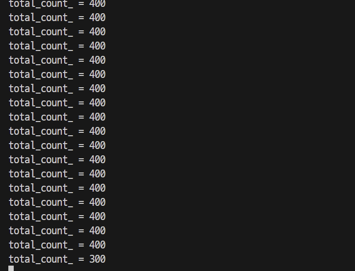
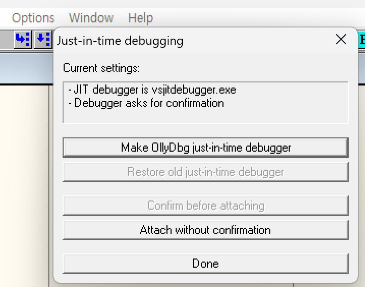

## ? Chapter 4: 시스템 해킹
#### <ins>시스템 해킹</ins> ?
- 운영체제 해킹 (OS System Hacking)
- 접근권한이 없는 컴퓨터의 자원에 대해 접근하거나 정보를 유출하는 모든 기법

#### 컴퓨터 웜
- 인터넷에 있는 취약한 시스템을 찾아 스스로를 복제하는 악성 프로그램, 직접 다른 컴퓨터를 공격해 자신을 전파함
    - SQL 슬래머 웜
        - MS-SQL 서버에 버퍼 오버플로우 공격을 하기 위해 UDP port 1434 이용
        - 헤더를 포함해 400byte의 UDP 패킷안에 들어가기 때문에 TCP에서와 같이 응답을 기다릴 필요가 없어 빠르게 확산 
    - Code-Red 웜 

#### 해킹
- 접근 권한(ID/PW)가 없는 컴퓨터에 명령을 내린다.
- 현재 접근 권한이 있는 시스템에서 더 높은 접근 권한을 얻는다. (Priviliedge Escalation)
- How ???
    - <ins>실행중인 프로그램의 실행 흐름을 바꾼다</ins>
    - <ins>실행 할때 자동으로 높은 권한을 부여받는 프로그램의 실행 흐름을 바꾼다</ins>

### 환경 구축 ??
---
- 프로그램 분석 : windbg , IDA , gdb
- 공격 코드 작성 : 파이썬 

1. 파이썬 설치
2. cmd > `python` 파이썬 실행

### 명령어 삽입 공격 ???♂?
---
- 기존 명령어들을 재사용하거나 쉘 명령어들을 이용해 특정 기능 수행시 발생 가능
```c
//예제 4-1 ) 디렉터리에 있는 파일 목록을 표준출력으로 출력하는 기능 구현 함수
void print_current_dir_with_api(void){
    WIN32_FIND_DATA ffd;    //FindFileData
    HANDLE hFind = FindFirstFile(TEXT("*"),&ffd);
    if (hFind == INVALID_HANDLE_VALUE){
        printf("FindFirstFile failed (%d)\n",GetLastError());
        exit(1);
    }
    do{
        if (wcscmp(ffd.cFIleName,TEXT("."))!=0 && wcscmp(ffd.cFIleName,TEXT(".."))!=0){
            printf("%S\n",ffd.cFileName);
        }
    }while (FindNextFile(hFind,&ffd)!=0);
}
```
윈도우에서 제공하는 기본API (WINAPI)들만 이용해 현재 폴더의 모든 파일을 출력하는 코드다.

해당 기능을 수행하는 외부 프로그램이 있으면 외부 프로그램을 수행한 그 결과를 그대로 쓰면된다.

많은 프로그래밍 언어들이 외부 프로그램을 수행하기 위한 방법으로 텍스트기반 명령어 처리기를 이용한다.
#### 명령어 처리기
- C언어에서는 외부 프로그램을 수행할 수 있는 함수로 `system()`을 제공
    - 운영체제 기본명령어 처리기
    - 인자로 들어온 문자열을 실행하고 그결과 출력
    ```c
    //예제 4-2 ) system()으로 dir명령어 수행함으로써 똑같은 기능을 수행하는 프로그램을 더 빠르게 작성가능
    void print_current_dir_with_system(void){
        system("dir /B");
    }
    ```
    ↘? 이런식으로 "재사용"

#### 명령어 삽입 공격
```c
//예제 4-3 ) 인자로 디렉터리명을 받아 파일 목록을 출력하는 프로그램
#include <stdio.h>
#include <stdlib.h>
#include <string.h>

const int kCmdLen = 400;
void print_dir_with_system(char *path){
    char cmd[kCmdLen];
    const char* cmd_prefix = "dir /B";
    if (strlen(cmd_prefix)+strlen(path)+1<kCmdLen){
        _snprintf(cmd,kCmdLen,"%s %s",cmd_prefix,path); //cmd_prefix와 path를 %s %s 로 결합한 문자열을 kCmdLen만큼 cmd에 저장
    }
    system(cmd);
}

int main(int argc, char* argv[]){
    char* exec_file = argv[0];  //실행파일명
    char* path = argv[1];   //경로
    if (argv==2) print_dir_with_system(path);
    else printf("Usage> %s [filename]\n",exec_file);
    return 0;
}
```
첫번째 인자로 넘어온 폴더에 있는 파일 목록을 출력한다.

> ? 첫번째 인자로 들어가는 파일명 뒤에 `. && echo oops`를 입력하면? sprintf문으로 cmd.exe에 의해 `dir /B . && echo oops` 가 수행된다.`&&` 는 명령어 처리기에서 한 줄에 며러 명령어를 수행하도록 한다. 

#### 명령어 삽입 취약점이 발생하는 패턴
- 어떤 언어든지 간에 일반적으로 프로그램 내에서 `system()`같이 직간접적으로 명령어 처리기를 사용하는 함수를 호출하는 코드가 있어야한다.

▼ 각 언어별 주의해야할 실행 함수
|언어|구성|
|--|--|
|C/C++|운영체제 공통: system(),popen(),execlp(),execvp()|
||윈도우 공통: ShellExecute, CreateProcess_wsystem()|
|Perl|System(),exec(),\`,\|,eval(),정규표현식/e연산자|
|파이썬|exec,eval,os.sytem,os.open,execfile,input,compile|
|자바|Class,forName(string name),class,newInstance,Runtime,exec()|
|C#|System,Diagnostics,Process,Start()|


#### 명령어 삽입공격에 사용되는 명령어 처리기 연산자

▼ 명령어 처리기에 특수하게 사용되는 명령어
|연산자|사용법|의미|
|---|---|--|
|>|prog>file|prog수행결과로 나온 표준출력을 file로 저장. (덮어쓰기)|
|>>|prog>>file|prog수행결과로 나온 표준출력을 file뒤에 추가|
|<|prog<file|file의 내용을 prog의 표준입력으로 전달|
|\||prog1\|prog2|prog1의 표준출력을 prog2의 표준입력으로 전달|
|&&|prog1&&prog2|prog1 명령수행이 성공적이면 prog2 호출|
|\|\||prog1\|\|prog2|prog1 명령수행이 실패하면 prog2 호출|
|;(리눅스)|prog1;prog2|prog1 수행 후 prog2 수행|
|&(윈도우)|prog1&prog2|prog1 수행 후 prog2 수행|
|&(리눅스)|prog&prog1|prog를 백그라운드에서 수행하고 prog1을 수행|
|$()(리눅스)|$(command)| 해당 구문이 command를 수행한 결과로 치환|
|`(리눅스)|'command'|해당 구문이 command를 수행한 결과로 치환|

>특히 유닉스계열에만 있는 $() 와 ` 는 앞뒤의 명령어가 붙은 것과 상관없이 명령어 수행 전에 독립적으로 수행할 수 있어서 실제 공격에서 아주 유용하게 사용됨.


### 레이스 컨디션 ? 
---
- Race Condition Attack 
- 서로다른 프로세스나 스레드가 같은 자원을 공유할 때, 실행 순서에 따라 결과가 달라질 수 있는 현상을 이용
- 병행성 : 운영체제에서 여러 연산을 동시에 처리할수있는 특성
    - 분할 처리
    - 멀티 코어
 ```c
 //예제 4-4 ) 병행성 테스트를 위한 코드
#include <stdio.h>
#include <windows.h>

const int kLoopCount = 4*100;
int total_count_ = 0;
int main(){
    for (int i=0; i<kLoopCount;i++){
        total_count_++;
    }
    printf("total_count_ = %d\n",total_count_);
    return 0;
}
//출력
//total count =400
```
병행성을 이용해 이 프로그램이 빠르게 동작하도록 해보자. 
- CPU의 개수별로 스레드를 만들어 각각의 부하를 1/(코어개수)로 줌으로써, 기존에 하나의 CPU에서만 작동함에 따라 생기는 부하를 줄일 수 있다.
- 메모리변수 (total_count_)를 사용함으로써 발생하는 부하를 줄이기 위해, 계산 과정의 중간 결과 값을 지역 변수에 저장해서 연산이 끝났을때 이를 반영하도록 한다.
```c
//예제 4-5 ) 병행성을 이용한 숫자 증가 프로그램
#include <stdio.h>
#include <windows.h>

const int kLoopCount = 400;
const int kNumThread = 4;
const int kIncreaseLoopCount = kLoopCount/kNumThread;
int total_count_ = 0;

DWORD WINAPI MyThreadFunction(LPVOID lpParam){
    int temp =total_count_;

    for ( int i=0; i<kIncreaseLoopCount;i++) temp++;
    total_count_=temp;
    return 0;
}

void concurrent_solver(){
    total_count_=0;
    HANDLE hThreadArray[kNumThread];
    DWORD dwThreadIdArray[kNumThread];

    for (int i=0; i<kNumThread;i++){
        hThreadArray[i]=CreateThread(
            NULL,   //기본 보안 식별자 사용
            0,  //기본 스택 사이즈 사용
            MyThreadFunction,   //스레드로 실행할 함수 이름
            NULL,   //스레드에 전달될 인자
            0,  //생성 플래그
            &dwThreadIdArray[i]);   //스레드 식별자를 저장할 변수
    }

    WaitForMultipleObjects(kNumThread,hThreadArray,TRUE,INFINITE);

    for (int i=0; i<kNumThread;i++) CloseHandle(hThreadArray[i]);
    
}


int main(){
    concurrent_solver();
    printf("total_count_ = %d\n",total_count_);
    return 0;
}
//출력
//total count =400
```
MyThreadFunction() 함수는 스레드 개수에 맞춰 계산량을 서로 분담해 계산한다

4개의 스레드를 생성해 100번씩 증가 연산을 수행한다.

여기서 main함수만 바꿔보자.
```c
//예제 4-6 ) 4-5에서 수정된 main 함수
int main(){
    while(1){
        concurrent_solver();

        printf("total_count_ = %d\n",total_count_);

        if (total_count_ != kLoopCount){
            getchar();
        }
    }
    return 0;
}
```
 이렇게 마지막줄에 total count값이 300인 것을 볼 수 있다.
프로그램이 우리가 작성한 대로 동작했으면 항상 4*100=400이 되어야하지만 다르게 나왔다.

Why???

▼ 예제 4-6에서 두 스레드가 수행하는 명령을 시간에 따라 도식화
|시간|Thread A (CPU 0)|Thread B (CPU 1)|
|---|---|---|
|1|int temp=total_count_;|int temp =total_count_;|
|2|for() temp++|for() temp++|
|3|total_count_=temp;|total_count_|temp;|

표를보면, MyThreadFunction() 첫번째 줄이 원인이다.

temp 변수에 들어가는 입력에 따라 total_count_ 결과값이 정해지는데, 스레드A, 스레드B 둘다 total_count_ 로부터 같은 값을 받기 때문에 단지 하나의 스레드를 수행한 결과만이 반영된다.

따라서 두 스레드를 수행하고 하나의 스레드만 수행한 효과를 얻는다.

> 여러 프로세스나 스레드가 수행되는 순서에 따라 수행결과가 달라지는 현상을 <ins>레이스 컨디션</ins>이라고 한다.

#### 레이스 컨디션 취약점
앞의 MyThreadFunction함수를 아래와 같이 수정해보자
```c
//예제 4-7 ) 수정된 MyThreadFunction() 함수
DWORD WINAPI MyThreadFunction (LPVOID lpParam){
    for (int i=0; i<kIncreaseLoopCount;i++) total_count_++;
    return 0;
}
```
▼ 예제 4-7에서 두 스레드가 수행하는 명령을 시간에 따라 도식화
|시간|Thread A (CPU 0)|Thread B (CPU 1)|
|---|---|---|
|1|total_count_++;|total_count_++;|

CPU에서 한번에 처리되는 명령이므로 해결될까 싶었는데 다시 엉뚱한 숫자가 나온다.

Why???

total_count_ ++ 는 C언어에서 하나의 연산이지만, 사칙연산과 관련된 명령어들은 인자값 중 하나가 레지스터여야하는 규칙이 있어 3개의 명령으로 나뉜다.
```assembly
mov eax,dword ptr ds:[01078130h] 
add eax,1
mov dword ptr ds:[9197813h],eax
```
최적화 정도에 따라 total_count_ 가 미리 레지스터에 복사된 경우도 있기때문에 이를 그대로 사용한다.

▼ total_count++ 가 CPU에서 <ins>기계어</ins>로 실행되는 방식
|시간|Thread A (CPU 0)|Thread B (CPU 1)|
|--|---|---|
|1|mov eax,dword ptr ds:[01078130h]|mov eax,dword ptr ds:[01078130h]|
|2|add eax,1|add eax,1|
|3|mov dword ptr ds:[9197813h],eax|mov dword ptr ds:[9197813h],eax|
4-6에서 사용한 패턴과 동일 하다. 따라서 동일한 문제가 발생하게 된다.

### 메모리 오염 공격 ??
---
- **메모리 오염 (Memory corruption)** : 프로그래머 예상과 달리, 잘못된 구현 등으로 의도하지 않은 메모리를 사용자가 덮어쓸 수 있는 문제점
#### 메모리 오염 공격
- 정상적인 프로그램 수행을 방해하는 메모리 조작
- 프로그램이 개발자의 의도와 다르게 메모리를 쓰거나 읽는 행위
```c
//예제 4-8 ) 정수형 변수와 문자열 형태의 변수를 문자열로 출력하는 코드
#include <stdio.h>

int main()
{
    int a=0x00434241;
    char b[4] = "ABC";

    printf("%s\n",b);
    printf("%s\n",&a);

    return 0;
}
```
소스를 보면 a가 정수형으로 선언됨을 알 수 있다.

컴파일된 코드를 리버싱하는 입장에서는 a,b 모두 문자열 변수라고 분석한다.

Why ???

프로그래밍 언어의 소스코드가 기계어로 번역되면서 이런 문맥에 대한 정보를 비워버리기 때문.

int를 문자열처럼 사용하는 경우일뿐. 개발자가 처음 프로그램의 구조를 설계할 때는 결함이 발견될 수 있다. 이를 <ins>디자인 결함 (Design Flaw)</ins> 라고하는데, 프로그래머가 의도한 바를 구현하는 방법 자체에 문제가 있는 것이다. 

+ 명령어 삽입 공격이 발생하는 소프트웨어는 명령어 처리기에서 특수문자가 어떻게 처리되는지를 간과해서 발생하는 디자인 결함의 범주에 속한다.

프로그램 : 컴퓨터에게 특정 작업을 수행하도록 하는 간단한 명령어 묶음

`소스코드 -> (컴파일러) -> 어셈블리코드 -> (어셈블러) -> 기계어 -> (CPU) -> 실행`

기계어와 비교하면 C언어는 high level 언어로 많은 추상적 개념을 포함하고있다.
- ex) C언어에서 사용하는 데이터 타입은 기계어로 표현할 수 없는 추상적 개념이다. `배열길이, int, char, double 같은 데이터 타입 역시 기계어로 표현 불가.` 다만 명령어의 인자로 간접적으로 유추가능. 

#### 버퍼 오버플로우 공격
- 프로그래머가 사용하려고 할당한 메모리보다 더 많은 양의 메모리를 덮어쓸 때 발생
1. 버퍼오버플로우가 발생하는 메모리 영역을 기준으로 분류.
2. 취약한 코드 패턴에 따른 분류.
- 인접한 메모리 영역 덮어쓰기
- 오브 바이 원 버그 
    - 오프 바이원 : 1차이로 인해 오동작하는 논리 오류
    - 연산 수행하는 반복문 구조에서 횟수를 지정할때 자주 발생.
    - 1byte만 덮어쓸 수 있으면 뭘 할수있을까?

        ```c
        //예제 4-9 ) 1바이트 오버플로우에 취약한 예제
        #include <stdio.h>
        #include <string.h>

        const int kBufSize = 128;

        void off_by_one1(char* in_buf){
            char out_buf[128]="";
            int in_buf_len=strlen(in_buf);
            for (int i=0; i<=in_buf_len;i++){
                out_buf[i]=in_buf[i];   //out_buf가 strlen(in_buf)+null포함 최대 129자 까지 가능
                // 하지만, strlen(in_buf)길이가 128로 정해져있으므로, in_buf크기가 128을 넘으면 overflow 발생
            }
        }

        void off_by_one2(char* in_buf){
            char out_buf[128]="";
            int in_buf_len=strlen(in_buf);

            if(in_buf_len<=kBufSize){
                strcpy(out_buf,in_buf); //in_buf가 128byte면, strcpy가 널까지 포함하여 129byte를 in_buf에 보내 overflow 발생
            }
            printf("%s\n",out_buf);
        }

        int main(int argc, int* argv[]){
            off_by_one1(argv[1]);
        }
        ```
        - **strcpy**는 추가적으로 null까지 포함하여 복사한다.
        - 컴파일러에서 자동으로 변수사이에 임의의 바이트를 넣는 Padding이라는 개념때문에 자주 발생하는 조건이 필요하지만, 오래된 프로그램이나 컴파일러의 경우 종종 발견 가능.
- 더블프리 버그
    - `free()` 함수가 두번 이상 같은 메모리에 호출되었을때  발생
    - 프로그램 구조가 복잡해 메모리를 어디서 해체해야할지 착각하여 코드 배치를 잘못 했을때 발생
    - 예외처리의 실수를 악용한 공격자가 의도적인 에러를 유발해 프로그램 버그를 만듦
    - 같은 주소를 중복해서 free()가되면 버퍼오버플로우 현상 발생가능 (malloc()이 두번 같은 메모리를 리턴할 수 있게 되고, 이를 이용해 공격자가 버퍼 오버플로우 현상을 일으킴)
    - 한 메모리가 서로 다른 두 스트링으로 사용되는데 한곳에서는 a, 한곳에서는 b로 제한해서 사용한다하자.
        - => <ins>큰 쪽으로 메모리를 채우고 작은 쪽에서 사용하게하면 상대적 길이차로 버퍼 오버플로우 발생 시킬수 있다.</ins>

        ```c
        //예제 4-10 ) 더블프리 버그에 취약한 코드
        #include <stdio.h>
        int main(){
            char* ptr= (char*)malloc(SIZE);
            ...
            if (abrt){
            free(ptr); 
            }
            ...
            free(ptr);
        }
        ```
- 스택 영역
    - CPU가 실행중에 필요한 정보를 저장하는 메모리 영역
    - 함수인자, 지역변수, 스택프레임 주소, 리턴주소

    ```c
    //예제 4-11 ) 스택 기반의 오버플로우 취약점이 있는 프로그램
    #include <stdio.h>
    #include <string.h>

    const int kBufSize=16;

    int main(int argc, char* argv[]){
        char buf_one[kBufSize]="hello";
        char buf_two[kBufSize]="World";

        strcpy(buf_two,argv[1]);

        printf("&buf_one = %p, content = %s\n",&buf_one,buf_one);
        printf("&buf_two = %p, content = %s\n",&buf_two,buf_two);
    }
    ```
    - buf_two 가 buf_one보다 더 앞쪽 메모리를 차지하므로 16보다 넘는 입력값을 주었을때, buf_two가 덮어지면서 buf_one까지 영향을 준다.
- 데이터 영역
    - 프로그래밍시 전역적으로 사용되는 정보를 저장하는 메모리 영역
    - 전역변수, 정적 변수
        - 초기화된 변수 영역(데이터영역) 
            - const 키워드로 선언된 읽기 전용 영역
            - 읽기/쓰기 같이되는 영역
            ```
            ex) char *string ="hello world"; 
                "hello world" --- 읽기 전용 영역
                static int a=0; global int i=10; ---읽기/쓰기 영역 
            ```
        -  초기화X 변수 영역(BSS영역)
- 힙 버퍼 오버플로우
    - 힙: 프로그램 수행시 동적으로 할당하고 해제하면서 사용할 수 있는 메모리 영역
        - 청크 chunck : 동적으로 메모리 할당 해제시 사용하는 메모리 단위
    - 인접한 메모리 청크를 서로 덮어쓰는 패턴
        - 연달아 할당받은 메모리는 서로 인접할 확률이 높으므로, 처음 할당받은 메모리 청크 부분을 덮으면 뒷부분에 해당하는 메모리 청크 부분에 데이터를 쓸 수 있다.
- **선언 순서에 따른 지역변수의 메모리 배치 순서**
    ```c
    //예제 4-12 ) 각 변수의 메모리 주소를 출력하는 프로그램
    #include <stdio.h>
    int main(){
        int buf11, buf12;
        int buf21, buf22;
        printf("&buf11 = %p, &buf12 = %p\n",&buf11,&buf12);
        printf("&buf21 = %p, &buf22 = %p\n",&buf21,&buf22);
    }
    ```
    - buf22 buf21 buf12 buf11 순으로 주소가 정렬되어있음.
    > 지역변수는 마지막에 선언할수록 앞부분(낮은주소)에 배치된다.
- **올리디버거 JIT 설정**
    - JIT : 현재 문제가 발생한 프로세스에 그대로 디버거를 연결해 분석하는 방법
        - 프로그램이 실행중 예상치 못한 버그로 죽어버리는 경우 원인 분석하는데 사용
    
#### 형식 문자열
- 형식 문자열 format string : 출력값을 일정한 양식에 맞게 통일시키기 위해 사용하는 규격을 정하는 문자열
```c
//예제 4-13 ) 형식 문자열 사용 예제
#include <stdio.h>
using namespace std;

const char* name[]={"Jeff Dean","Sanjay Ghemawat","Sebastian Thrun","Larry Page","Sergey Brin"};
const int score[] ={1968,-1,1967,1973,1973};
const int num_of_people=sizeof(score)/sizeof(int);
int main(){
    printf("%20s %s\n","Name","Brith year");
    for (int i=0;i<num_of_people;i++) printf("%20s %d\n",name[i],score[i]);
}
```

- 포맷스트링 취약점 : 포맷스트링을 사용하는 함수의 입력을 사용자가 임의로 조작할 수 있을때 발생

```c
//예제 4-14 ) 형식 문자열 취약점이 있는 소스 코드
#include <stdio.h>
int main(int argc, char* argv[]){
    if(argc!=2){
        fprintf(stderr,"Usage>%s [string]\n",argv[0]);
    }
    printf(argv[1]);
}
```
- 첫번째 인자로 주어진 문자열을 그대로 출력하는 프로그램.
 `./example "%x %x %x %x %x %x"`넣으면 메모리에 있는 어떤 값들을 출력함.
    - 원래 호출되어야할 모양은 printf("%x %x %x %x %x",v1,v2,v3,v4,v5); 이다.
    - v1~v5는 스택의 어딘가에 저장이 될 것 이다.( 스택은 함수에 전달할 인자를 저장하는 역할을 함)
    - 따라서 결과값은 %x에 대응되는 메모리 내용을 출력한다.
#### 정수 오버플로우/언더플로우 공격
- 일반적 오버플로우 : `strcpy()`,`memcp()` 등의 경계값을 제대로 체크하지 않은 변수 복수의 문제를 이용한 공격법.
- 정수 오버플로우 : 연산결과가 저장하려는 데이터 타입이 표현할 수 있는 범위를 벗어나는것
    - 연산 결과가 데이터타입이 저장할 수 있는 최대값보다 크면 오버플로우, 최소값보다 작으면 언더플로우
    - 정수형 데이터타입을 사용하는 모든 프로그램은 정수형 오버플로우가 발생 가능
    ```c
    //예제 4-15 ) 정수형 오버플로우 발생
    #include <stdio.h>
    int main(){
        int a=1234567890;
        int b= 1234567890;
        int c= a+b;

        printf("a   = %d\n",a);
        printf("b   = %d\n",b);
        printf("a + b = %d\n",a+b);
    }
    ```
### 실전
---
#### 크래시 발생시키기
#### EIP 덮어쓰기
